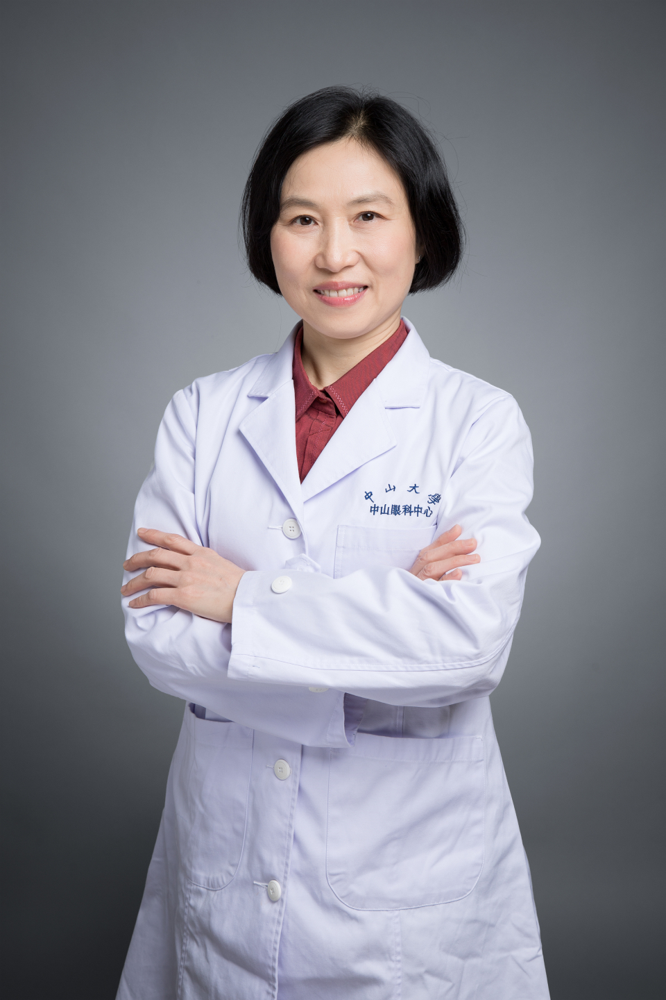

<!-- AUTO-GENERATED-BY: work/generate_obsidian_profiles.py -->

# 何丽文

## 基础信息

| 字段 | 内容 |
|---|---|
| 医院 | 中山大学中山眼科中心 |
| 姓名 | 何丽文 |
| 科室 | 眼科急症、眼外伤 |
| 职称/身份 | 主任医师 |
| 重点优先级 | 高 |
| 来源类型 | 医院官网 |
| 来源链接 | [官网原文](http://www.gzzoc.org.cn/node/3109) |
| 采集日期 | 2026-08-09 |
| 复核状态 | 待人工复核 |
| 异常提示 |  |

## 简介/擅长

擅长处理眼外伤急症重症，专攻眼外伤复杂疑难病例

## 详情正文摘录

医学博士，主任医师，硕士研究生导师。毕业于中山医科大学，后获德国Freiburg大学医学博士学位。一直在中山大学中山眼科中心从事医疗、教学和科研工作，长期致力于眼外伤患者的救治和复明事业，主治各类急症重症眼外伤，专攻眼外伤复杂疑难病例的临床诊断和治疗；擅长于眼外伤的急诊处理，虹膜、睫状体损伤修复，外伤性青光眼治疗，外伤性白内障摘除人工晶体植入，眼内存留异物取出，外伤性玻璃体视网膜病变和化脓性眼内炎的手术治疗。近年来致力于开展我国自主创新的人工玻璃体植入手术，以挽救难治性外伤性玻璃体视网膜病变的眼球，并从事干细胞移植治疗不可逆视网膜损伤的临床前研究。荣获第三届“羊城好医生”称号，多次获得中山大学《眼科学》英语授课优秀奖，荣获“叶任高-李幼姬”临床医学优秀中青年教师奖（优秀临床带教教师）。

## 重点关注范围

- 疑难重症

## 重点疾病标签

- 疑难
- 重症
- 难治
- 复杂

## 亮眼经历线索

- 主任医师 擅长处理眼外伤急症重症，专攻眼外伤复杂疑难病例 主任医师 擅长处理眼外伤急症重症，专攻眼外伤复杂疑难病例

## 异常提示

## 合规边界

- 本画像仅整理统一总底表中的医院官网公开字段。
- 不包含患者评价、排名、第三方来源内容或疗效承诺。
- 官网未展示的信息保持空白，后续如需补充须回到底表官方来源字段。
