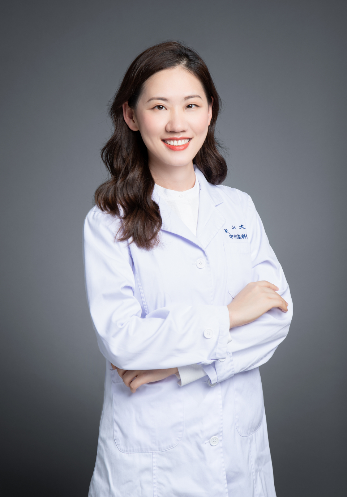

<!-- AUTO-GENERATED-BY: work/generate_obsidian_profiles.py -->

# 余曦灵

## 基础信息

| 字段 | 内容 |
|---|---|
| 医院 | 中山大学中山眼科中心 |
| 姓名 | 余曦灵 |
| 科室 | 眼底疾病 |
| 职称/身份 | 副主任医师 |
| 重点优先级 | 高 |
| 来源类型 | 医院官网 |
| 来源链接 | [官网原文](http://www.gzzoc.org.cn/node/3151) |
| 采集日期 | 2026-08-09 |
| 复核状态 | 待人工复核 |
| 异常提示 |  |

## 简介/擅长

擅长常见眼底疾病如糖尿病视网膜病变、高度近视视网膜病变、黄斑变性、视网膜脱离等的诊治。

## 详情正文摘录

医学博士，副主任医师，毕业于中山大学中山医学院临床医学八年制，曾于英国牛津大学附属John Radcliffe Hospital和美国印第安纳大学附属医院交换实习。作为第一作者在Ophthalmology、AJO等多个国际权威杂志发表学术论文，主持并参与多项国家和省级自然科学基金项目。

## 重点关注范围

- 慢性病

## 重点疾病标签

- 糖尿病

## 亮眼经历线索

- 副主任医师 副主任医师 医学博士，副主任医师，毕业于中山大学中山医学院临床医学八年制，曾于英国牛津大学附属John Radcliffe Hospital和美国印第安纳大学附属医院交换实习。
- 作为第一作者在Ophthalmology、AJO等多个国际权威杂志发表学术论文，主持并参与多项国家和省级自然科学基金项目。

## 异常提示

## 合规边界

- 本画像仅整理统一总底表中的医院官网公开字段。
- 不包含患者评价、排名、第三方来源内容或疗效承诺。
- 官网未展示的信息保持空白，后续如需补充须回到底表官方来源字段。
