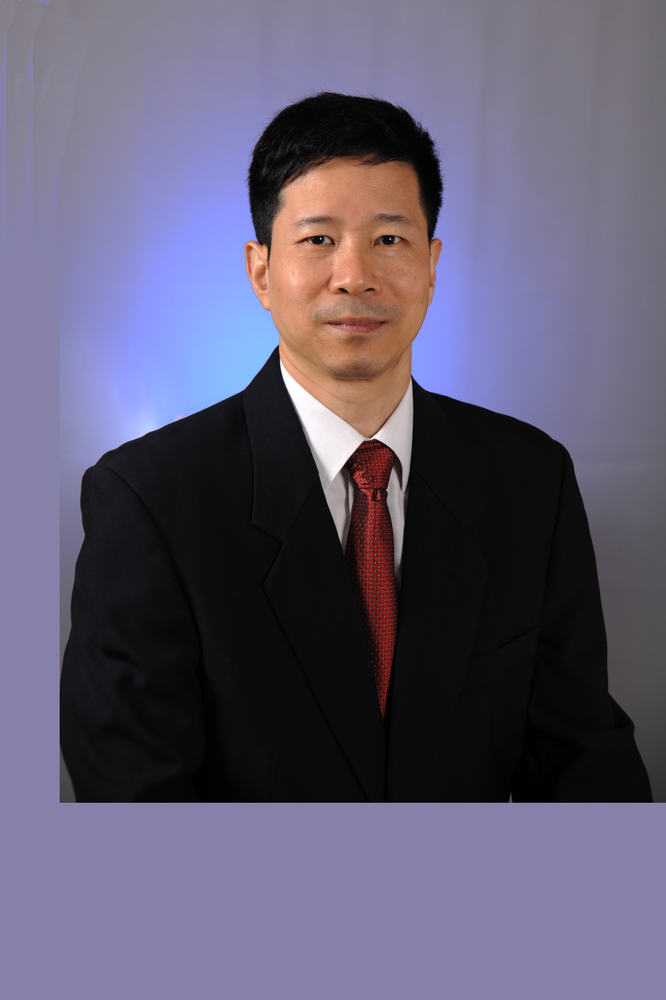

<!-- AUTO-GENERATED-BY: work/generate_obsidian_profiles.py -->

# 刘奕志

## 基础信息

| 字段 | 内容 |
|---|---|
| 医院 | 中山大学中山眼科中心 |
| 姓名 | 刘奕志 |
| 科室 | 白内障 |
| 职称/身份 | 教授 |
| 重点优先级 | 高 |
| 来源类型 | 医院官网 |
| 来源链接 | [官网原文](http://www.gzzoc.org.cn/node/3257) |
| 采集日期 | 2026-08-09 |
| 复核状态 | 待人工复核 |
| 异常提示 |  |

## 简介/擅长

擅长各种类型白内障超声乳化联合人工晶体植入手术，尤其对先天性白内障、晶状体脱位、硬核白内障、青光眼术后的白内障、合并葡萄膜炎的白内障、外伤性白内障等复杂病例的治疗具有极为丰富的临床经验。率先在国内开展超声乳化手术，并不断创新技术，在国际上率先开展扭动模式超声乳化手术，国内率先开展双手微切口超声乳化技术，囊袋张力环植入术等多项新技术。

## 详情正文摘录

刘奕志，二级教授，一级主任医师，博士研究生导师。国务院政府特殊津贴专家，中央保健会诊专家。白内障科学科带头人。亚太眼科学会常务理事，中华医学会眼科分会副主任委员，中华医学会眼科分会白内障人工晶状体学组副组长，广东省医学会副会长，广东省医学会眼科分会主任委员，《Molecular Vision》共同主编，《current Molecular Medicine》杂志副主编，《中华眼科杂志》等核心眼科杂志编委。 从事眼科医疗、教学、科研及防盲工作30余年，是国内最早开展白内障超声乳化联合人工晶体植入术的专家之一，为国内外白内障患者施术近20万例。擅长各种类型白内障超声乳化联合人工晶体植入手术，尤其对先天性白内障、晶状体脱位、硬核白内障、青光眼术后的白内障、合并葡萄膜炎的白内障、外伤性白内障等复杂病例的治疗具有极为丰富的临床经验。率先在国内开展超声乳化手术，并不断创新技术，在国际上率先开展扭动模式超声乳化手术，国内率先开展双手微切口超声乳化技术，囊袋张力环植入术等多项新技术。 目前承担国家自然科学基金国际合作项目1项，卫生部临床重点项目1项及国家自然科学基金、广东省自然科学基金等6项。主要从事晶状体发育、晶状体再生、发育基因的调控、晶状体蛋白质组学以及后发障防治机理以及超声乳化手术对眼组织的影响、人工晶状体研发等研究。以第一作者/通讯作者在国内外核心杂志发表论文80多篇，其中SCI 42篇；并获得国家科技进步奖、省科技进步一等奖等6项科技进步奖以及5项实用新型专利。 已培养并指导38名博士研究生从事白内障防治的基础及临床研究，其中培养杰青1名，新世纪人才2名，培养硕士博士生导师13名。 曾荣获全国五一劳动奖章，中国青年科技奖，全国中青年医学科技之星，中央保健工作先进个人，中国百名优秀青年志愿者，卫生部有突出贡献的中青年专家，全国优秀科普院长，广东省十大杰出青年，广东省突出贡献专家，广东省优秀中青年专家，广东省志愿服务最高荣誉奖，广东省五一劳动奖章，广东省优秀共产党员等多项荣誉称号。

## 重点关注范围

- 术后恢复/康复
- 疑难重症

## 重点疾病标签

- 术后
- 复杂

## 亮眼经历线索

- 率先在国内开展超声乳化手术，并不断创新技术，在国际上率先开展扭动模式超声乳化手术，国内率先开展双手微切口超声乳化技术，囊袋张力环植入术等多项新技术。
- 刘奕志，二级教授，一级主任医师，博士研究生导师。
- 国务院政府特殊津贴专家，中央保健会诊专家。

## 异常提示

## 合规边界

- 本画像仅整理统一总底表中的医院官网公开字段。
- 不包含患者评价、排名、第三方来源内容或疗效承诺。
- 官网未展示的信息保持空白，后续如需补充须回到底表官方来源字段。
