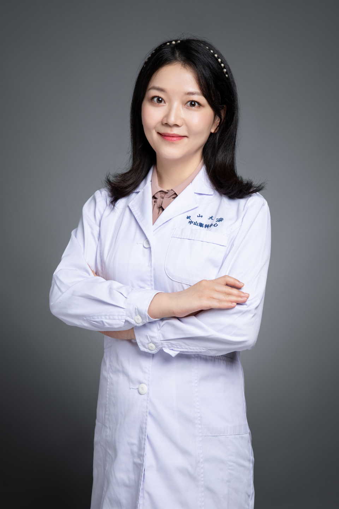

<!-- AUTO-GENERATED-BY: work/generate_obsidian_profiles.py -->

# 刘畅

## 基础信息

| 字段 | 内容 |
|---|---|
| 医院 | 中山大学中山眼科中心 |
| 姓名 | 刘畅 |
| 科室 | 近视眼激光治疗科 |
| 职称/身份 | 主治医师 |
| 重点优先级 | 高 |
| 来源类型 | 医院官网 |
| 来源链接 | [官网原文](http://www.gzzoc.org.cn/node/3244) |
| 采集日期 | 2026-08-09 |
| 复核状态 | 待人工复核 |
| 异常提示 |  |

## 简介/擅长

各类屈光不正的诊治，圆锥角膜的诊治，专注各类屈光手术、角膜交联手术及术后并发症处理。

## 详情正文摘录

眼科学专业博士，主治医生，广东省视光学会屈光手术专委会委员。已取得全国准分子激光医用设备上岗证，擅长各类屈光不正的诊治，圆锥角膜的诊治，屈光手术、角膜交联手术及术后并发症处理。长期从事屈光手术及角膜交联手术的临床及基础研究工作。主持广东省自然科学基金1项及省医学科研基金1项。

## 重点关注范围

- 术后恢复/康复

## 重点疾病标签

- 术后

## 亮眼经历线索

- 眼科学专业博士，主治医生，广东省视光学会屈光手术专委会委员。

## 异常提示

## 合规边界

- 本画像仅整理统一总底表中的医院官网公开字段。
- 不包含患者评价、排名、第三方来源内容或疗效承诺。
- 官网未展示的信息保持空白，后续如需补充须回到底表官方来源字段。
