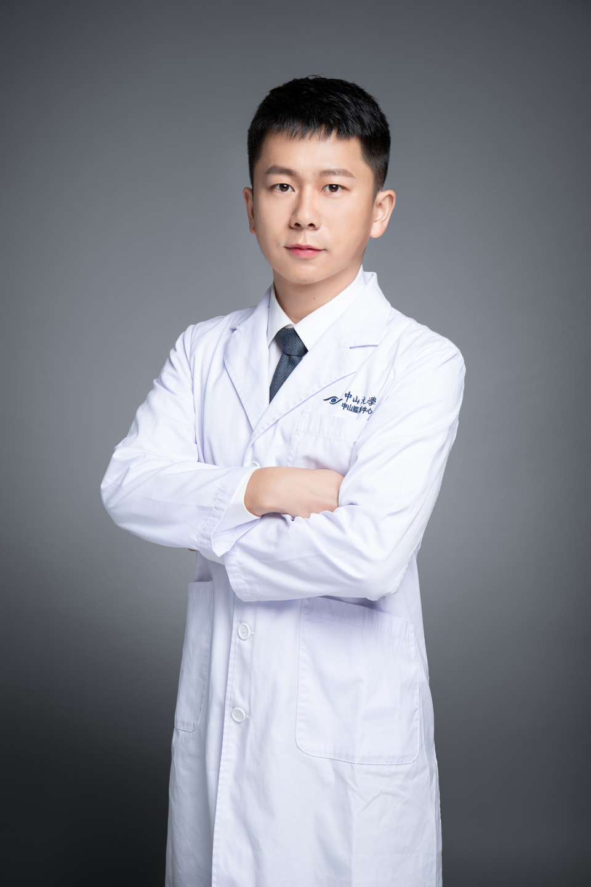

<!-- AUTO-GENERATED-BY: work/generate_obsidian_profiles.py -->

# 叶一明

## 基础信息

| 字段 | 内容 |
|---|---|
| 医院 | 中山大学中山眼科中心 |
| 姓名 | 叶一明 |
| 科室 | 近视眼激光治疗科 |
| 职称/身份 | 副主任医师 |
| 重点优先级 | 中 |
| 来源类型 | 医院官网 |
| 来源链接 | [官网原文](http://www.gzzoc.org.cn/node/3248) |
| 采集日期 | 2026-08-09 |
| 复核状态 | 待人工复核 |
| 异常提示 |  |

## 简介/擅长

擅长全飞秒，半飞秒，表层激光手术治疗各类屈光不正，在ICL手术方案设计上有较为丰富的临床经验和独到见解。

## 详情正文摘录

眼科学博士，副主任医师，毕业于中山大学中山眼科中心。擅长全飞秒，半飞秒，表层激光手术治疗各类屈光不正，在ICL手术方案设计上有较为丰富的临床经验和独到见解。以第一作者或共同第一作者在国际权威眼科杂志发表SCI论文10篇。主持国家自然科学基金青年基金1项，参与国家及省自然科学多项。现任广东省激光医学会眼科学组委员秘书，广东省眼健康协会屈光手术专业委员会委员，2023年度广东省援疆先进个人。

## 重点关注范围

## 重点疾病标签

## 亮眼经历线索

- 副主任医师 副主任医师 眼科学博士，副主任医师，毕业于中山大学中山眼科中心。
- 以第一作者或共同第一作者在国际权威眼科杂志发表SCI论文10篇。

## 异常提示

## 合规边界

- 本画像仅整理统一总底表中的医院官网公开字段。
- 不包含患者评价、排名、第三方来源内容或疗效承诺。
- 官网未展示的信息保持空白，后续如需补充须回到底表官方来源字段。
