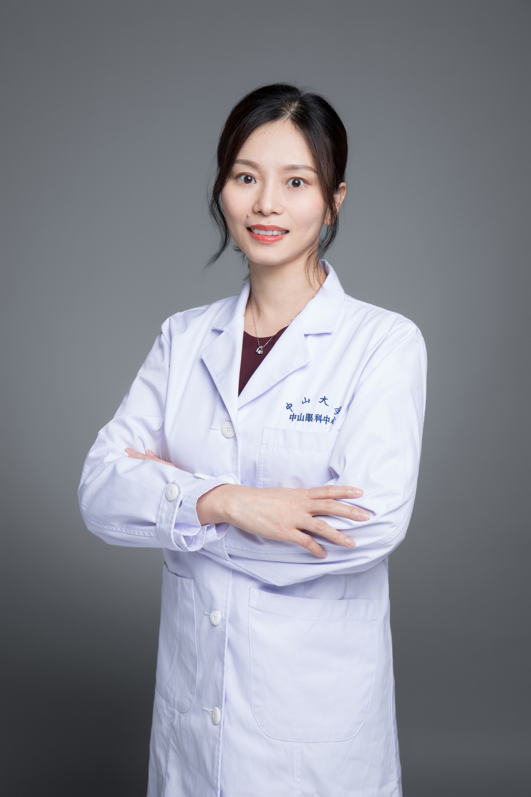

<!-- AUTO-GENERATED-BY: work/generate_obsidian_profiles.py -->

# 叶慧菁

## 基础信息

| 字段 | 内容 |
|---|---|
| 医院 | 中山大学中山眼科中心 |
| 姓名 | 叶慧菁 |
| 科室 | 眼眶病与眼肿瘤 |
| 职称/身份 | 副主任医师 |
| 重点优先级 | 高 |
| 来源类型 | 医院官网 |
| 来源链接 | [官网原文](http://www.gzzoc.org.cn/node/3126) |
| 采集日期 | 2026-08-09 |
| 复核状态 | 待人工复核 |
| 异常提示 |  |

## 简介/擅长

擅长眼眶病和眼肿瘤的诊治，尤其是甲状腺相关眼病、眼眶肿瘤、眼眶炎症、视网膜母细胞瘤、脉络膜黑色素瘤、眼睑和角结膜良恶性肿瘤等眼眶病眼肿瘤的手术、微创治疗、内镜辅助微创治疗及综合治疗。

## 详情正文摘录

副主任医师，硕士研究生导师，硕/博士均毕业于中山大学中山眼科中心，师从眼眶病名专家杨华胜教授。中国超声医学工程学会委员，广州市医师协会青年医师分会常委，中华医学会眼科学分会会员，亚太眼整形外科学会终生会员。从事眼科医疗、教学及科研工作10余年，具有丰富的眼眶病与眼肿瘤诊治经验。尤其对甲状腺相关眼病、眼眶肿瘤、眼眶炎症等眼眶疾病，以及视网膜母细胞瘤、脉络膜黑色素瘤、眼睑和角结膜良恶性肿瘤等眼肿瘤的发病机制、微创治疗、内镜辅助微创治疗、手术及手术后整形、化疗等治疗策略有深入研究。曾主持和参加多项国家级、省级课题，在国际国内顶级或高水平杂志发表文章40多篇，获中国实用新型专利2项，参与编写学术著作3部。

## 重点关注范围

- 肿瘤
- 术后恢复/康复

## 重点疾病标签

- 肿瘤
- 瘤
- 化疗
- 术后

## 亮眼经历线索

- 副主任医师 副主任医师 副主任医师，硕士研究生导师，硕/博士均毕业于中山大学中山眼科中心，师从眼眶病名专家杨华胜教授。
- 中国超声医学工程学会委员，广州市医师协会青年医师分会常委，中华医学会眼科学分会会员，亚太眼整形外科学会终生会员。

## 异常提示

## 合规边界

- 本画像仅整理统一总底表中的医院官网公开字段。
- 不包含患者评价、排名、第三方来源内容或疗效承诺。
- 官网未展示的信息保持空白，后续如需补充须回到底表官方来源字段。
