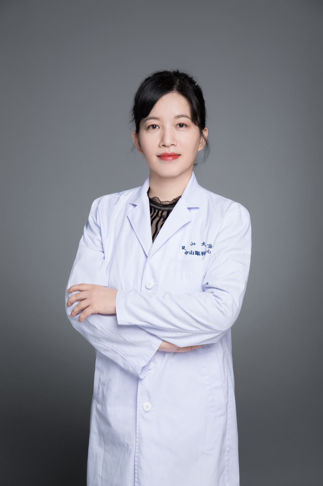

<!-- AUTO-GENERATED-BY: work/generate_obsidian_profiles.py -->

# 吴君舒

## 基础信息

| 字段 | 内容 |
|---|---|
| 医院 | 中山大学中山眼科中心 |
| 姓名 | 吴君舒 |
| 科室 | 近视眼激光治疗科 |
| 职称/身份 | 主任医师 |
| 重点优先级 | 中 |
| 来源类型 | 医院官网 |
| 来源链接 | [官网原文](http://www.gzzoc.org.cn/node/3246) |
| 采集日期 | 2026-08-09 |
| 复核状态 | 待人工复核 |
| 异常提示 |  |

## 简介/擅长

擅长近视、散光、远视的手术治疗，成功完成大量全飞秒、半飞秒激光、准分子激光等近视矫正术。对圆锥角膜的角膜交联手术有丰富的临床经验。

## 详情正文摘录

博士，主任医师，硕士研究生导师。曾赴香港大学玛丽医院访问工作，广东省第一批杰出青年医学人才，获“广州市实力中青年医师”称号。主持国家自然科学基金、广东省自然科学基金、广东省科技计划等多个科研项目。中华医学会激光分会青年委员、广东省医学会激光分会委员、广东省医师协会眼科学分会青年委员、广州市医学会眼科分会常委、广东省眼健康协会白内障屈光专业委员会副主任委员。

## 重点关注范围

## 重点疾病标签

## 亮眼经历线索

- 主任医师 主任医师 博士，主任医师，硕士研究生导师。
- 曾赴香港大学玛丽医院访问工作，广东省第一批杰出青年医学人才，获“广州市实力中青年医师”称号。

## 异常提示

## 合规边界

- 本画像仅整理统一总底表中的医院官网公开字段。
- 不包含患者评价、排名、第三方来源内容或疗效承诺。
- 官网未展示的信息保持空白，后续如需补充须回到底表官方来源字段。
