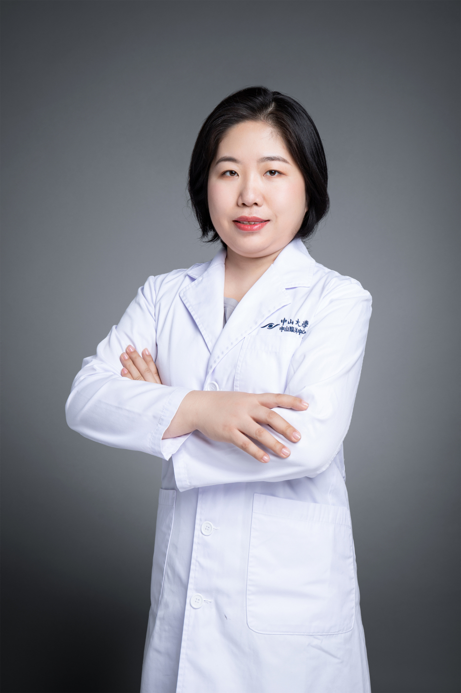

<!-- AUTO-GENERATED-BY: work/generate_obsidian_profiles.py -->

# 吴婧

## 基础信息

| 字段 | 内容 |
|---|---|
| 医院 | 中山大学中山眼科中心 |
| 姓名 | 吴婧 |
| 科室 | 角膜病、干眼与眼表疾病 |
| 职称/身份 | 主治医师 |
| 重点优先级 | 中 |
| 来源类型 | 医院官网 |
| 来源链接 | [官网原文](http://www.gzzoc.org.cn/node/3240) |
| 采集日期 | 2026-08-09 |
| 复核状态 | 待人工复核 |
| 异常提示 |  |

## 简介/擅长

角膜疾病、干眼症及眼表疾病

## 详情正文摘录

现任中山大学中山眼科中心角膜科主治医师，2016年中山大学中山眼科中心博士毕业。曾于2009至2012年于美国DUKE大学眼科中心研究中心工作，2014年于瑞典卡洛琳斯卡医学院交流学习。发表SCI论文（IOVS，MMR）5篇，其中第一作者2篇

## 重点关注范围

## 重点疾病标签

## 亮眼经历线索

- 曾于2009至2012年于美国DUKE大学眼科中心研究中心工作，2014年于瑞典卡洛琳斯卡医学院交流学习。
- 发表SCI论文（IOVS，MMR）5篇，其中第一作者2篇

## 异常提示

## 合规边界

- 本画像仅整理统一总底表中的医院官网公开字段。
- 不包含患者评价、排名、第三方来源内容或疗效承诺。
- 官网未展示的信息保持空白，后续如需补充须回到底表官方来源字段。
