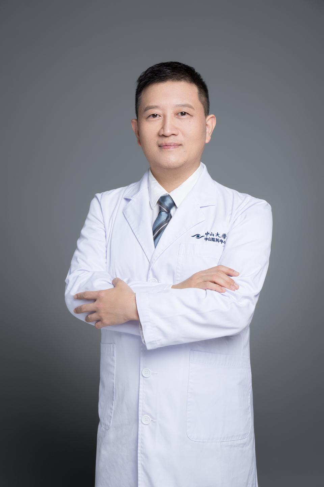

<!-- AUTO-GENERATED-BY: work/generate_obsidian_profiles.py -->

# 周胜

## 基础信息

| 字段 | 内容 |
|---|---|
| 医院 | 中山大学中山眼科中心 |
| 姓名 | 周胜 |
| 科室 | 近视眼激光治疗科 |
| 职称/身份 | 主任医师 |
| 重点优先级 | 中 |
| 来源类型 | 医院官网 |
| 来源链接 | [官网原文](http://www.gzzoc.org.cn/node/3247) |
| 采集日期 | 2026-08-09 |
| 复核状态 | 待人工复核 |
| 异常提示 |  |

## 简介/擅长

擅长激光手术矫正包括近视、远视/散光在内的各种屈光性眼病，对使用角膜交联治疗圆锥角膜具有丰富的临床经验。

## 详情正文摘录

主任医师，硕士研究生导师。现任中华医学会激光医学分会青年委员会副主任委员，广东省医学会激光分会委员，广东省医师协会眼科分会屈光组委员，美国JCAHPO认证医师、美国ARVO、AAO、ATPO及中华眼科学会会员。 曾于早年在中山大学获得眼科学博士学位后，在国家留学基金资助下先后赴加拿大和美国进行飞秒激光临床研究并同时接受专业屈光矫治手术培训和深造近两年。擅长使用飞秒激光、准分子激光矫正包括近视、远视、散光在内的各种屈光性眼病，同时对使用角膜交联手术治疗圆锥角膜具有丰富的临床经验。 主持广东省自然科学基金2项，广东省卫计委课题1项。先后在国内外发表专业学术论文30余篇，其中SCI论文10余篇。

## 重点关注范围

## 重点疾病标签

## 亮眼经历线索

- 主任医师 主任医师 主任医师，硕士研究生导师。
- 现任中华医学会激光医学分会青年委员会副主任委员，广东省医学会激光分会委员，广东省医师协会眼科分会屈光组委员，美国JCAHPO认证医师、美国ARVO、AAO、ATPO及中华眼科学会会员。

## 异常提示

## 合规边界

- 本画像仅整理统一总底表中的医院官网公开字段。
- 不包含患者评价、排名、第三方来源内容或疗效承诺。
- 官网未展示的信息保持空白，后续如需补充须回到底表官方来源字段。
