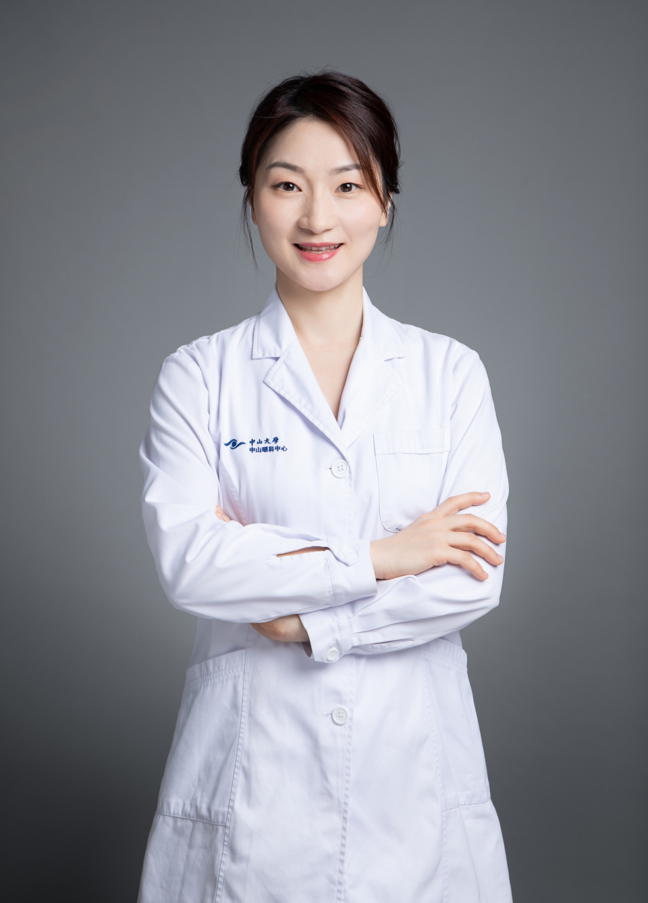

<!-- AUTO-GENERATED-BY: work/generate_obsidian_profiles.py -->

# 张婷

## 基础信息

| 字段 | 内容 |
|---|---|
| 医院 | 中山大学中山眼科中心 |
| 姓名 | 张婷 |
| 科室 | 眼底疾病 |
| 职称/身份 | 副主任医师 |
| 重点优先级 | 高 |
| 来源类型 | 医院官网 |
| 来源链接 | [官网原文](http://www.gzzoc.org.cn/node/3290) |
| 采集日期 | 2026-08-09 |
| 复核状态 | 待人工复核 |
| 异常提示 |  |

## 简介/擅长

擅长名类成人及儿童眼底常见病、疑难病的诊治。尤其是黄斑疾病、糖尿病视网膜病变、视网膜静脉阻塞、视网膜脱离、家族性渗出性玻璃体视网膜病变、先天性视网膜劈裂症、早产儿视网膜病变等疾病的诊断与治疗。

## 详情正文摘录

副主任医师、中山大学中山眼科中心博士，广东省眼健康协会委员兼秘书。擅长名类成人及儿童眼底常见病、疑难病的诊治。尤其是黄斑疾病、糖尿病视网膜病变、视网膜静脉阻塞、视网膜脱离、家族性渗出性玻璃体视网膜病变、先天性视网膜劈裂症、早产儿视网膜病变等疾病的诊断与治疗。从事眼科临床及科研工作15年，主持基金4项，包括国家自然科学青年基金1项、省自然3项，以第一作者或通讯作者身份在《英国眼科杂志》（BJO）、《转化视觉科学与技术》（TVST）、《眼睛》（EYE）等杂志上发表SCI论文12篇。

## 重点关注范围

- 慢性病
- 疑难重症

## 重点疾病标签

- 糖尿病
- 疑难

## 亮眼经历线索

- 副主任医师 擅长名类成人及儿童眼底常见病、疑难病的诊治。

## 异常提示

## 合规边界

- 本画像仅整理统一总底表中的医院官网公开字段。
- 不包含患者评价、排名、第三方来源内容或疗效承诺。
- 官网未展示的信息保持空白，后续如需补充须回到底表官方来源字段。
