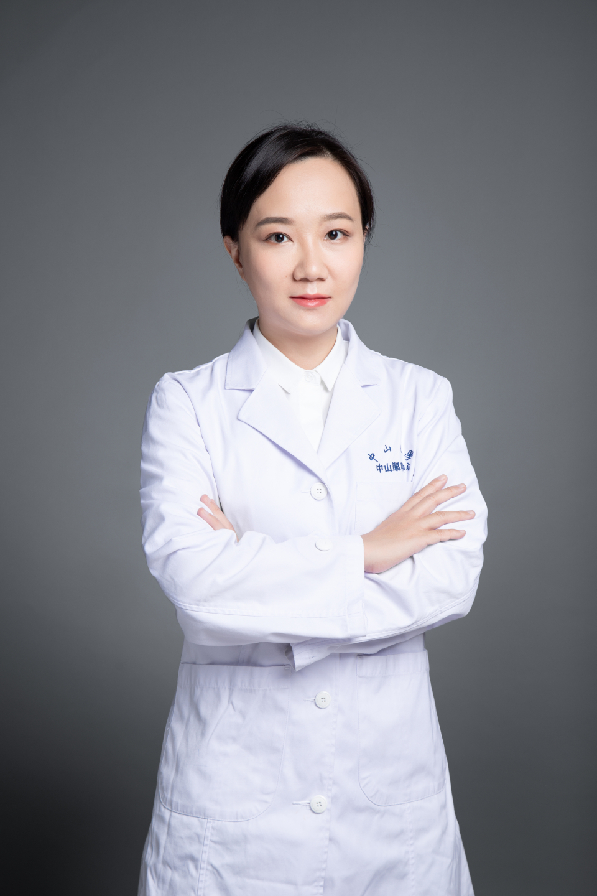

<!-- AUTO-GENERATED-BY: work/generate_obsidian_profiles.py -->

# 戴烨

## 基础信息

| 字段 | 内容 |
|---|---|
| 医院 | 中山大学中山眼科中心 |
| 姓名 | 戴烨 |
| 科室 | 眼免疫与葡萄膜炎 |
| 职称/身份 | 副主任医师 |
| 重点优先级 | 高 |
| 来源类型 | 医院官网 |
| 来源链接 | [官网原文](http://www.gzzoc.org.cn/node/3119) |
| 采集日期 | 2026-08-09 |
| 复核状态 | 待人工复核 |
| 异常提示 |  |

## 简介/擅长

葡萄膜炎、眼底病、白内障、角膜病的诊断和治疗。

## 详情正文摘录

医学博士，主持国家自然科学基金1项、眼科学国家重点实验室课题1项，参与多项国家级科研项目、广东省科技计划以及科技部港澳台合作专项，发表SCI文章多篇。

## 重点关注范围

- 免疫/风湿/感染

## 重点疾病标签

- 免疫

## 亮眼经历线索

- 副主任医师 副主任医师 医学博士，主持国家自然科学基金1项、眼科学国家重点实验室课题1项，参与多项国家级科研项目、广东省科技计划以及科技部港澳台合作专项，发表SCI文章多篇。

## 异常提示

## 合规边界

- 本画像仅整理统一总底表中的医院官网公开字段。
- 不包含患者评价、排名、第三方来源内容或疗效承诺。
- 官网未展示的信息保持空白，后续如需补充须回到底表官方来源字段。
