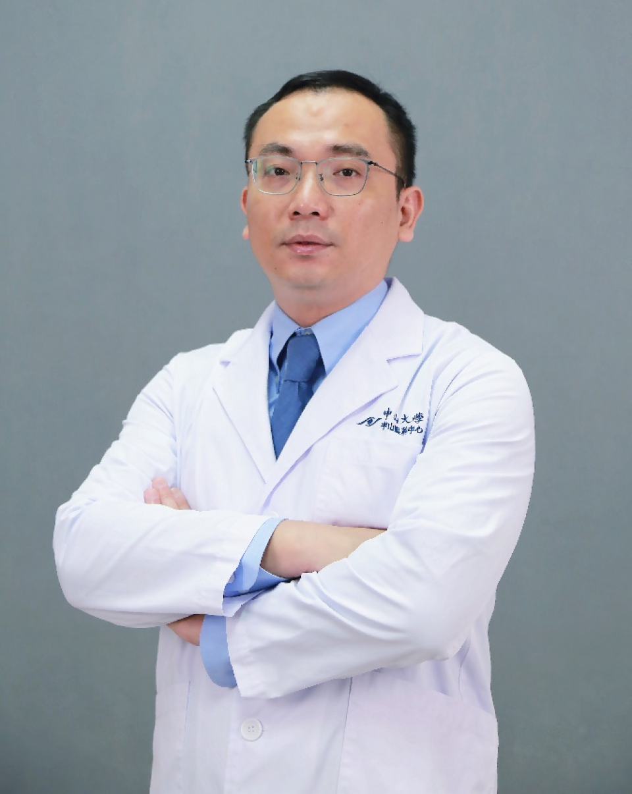

<!-- AUTO-GENERATED-BY: work/generate_obsidian_profiles.py -->

# 李劲嵘

## 基础信息

| 字段 | 内容 |
|---|---|
| 医院 | 中山大学中山眼科中心 |
| 姓名 | 李劲嵘 |
| 科室 | 斜视、弱视、双眼视觉功能 |
| 职称/身份 | 教授 |
| 重点优先级 | 高 |
| 来源类型 | 医院官网 |
| 来源链接 | [官网原文](http://www.gzzoc.org.cn/node/3192) |
| 采集日期 | 2026-08-09 |
| 复核状态 | 待人工复核 |
| 异常提示 |  |

## 简介/擅长

擅长领域 屈光不正（近视、散光、远视）、斜视、视疲劳、儿童和成人眼病后视力低下和低视力、脑病相关的视功能损害，阅读障碍和自闭症等疾病的视觉行为矫正和康复。

## 详情正文摘录

中山大学中山眼科中心视觉康复与重建平台负责人，教授，主任医师，眼科学和视光技术双学科博士研究生导师，博士后合作导师，医学八年制全程导师，广东省杰出医学青年； 学术兼职：中国残疾人康复协会视障辅助技术学组常务委员，广东省视光学会常务理事、视觉康复专业委员会主任委员，广东省康复医学会视觉康复分会副会长；南加州视光学院、香港理工大学访问学者： 临床工作主要为视觉行为矫正和视功能个体化康复，包括各类弱视、屈光不正（远视、近视、散光)、斜视、视疲劳、儿童和成人眼病后视力低下和低视力、脑病相关的视功能损害（CVI）、儿童视觉相关阅读障碍等疾病； 科学研究方向为应用计算机心理物理学、图像采集、EEG和fMRI等技术检测和康复视功能。近年来在Ophthalmology、IJS、CurrentBiology、Neurotherapeutics、IOVS、TVST等杂志上发表第一和通讯作者SCI论文40余篇。近年来来主持美国Thrasher Grant基金1项、国家自然科学基金(3项），国家重点研发项目子项目等十几项科研基金项目。国家自然科学基金评审专家，Opththalmology、IOVS等杂志审稿人。获得广东省科学技术进步一等奖等。

## 重点关注范围

- 术后恢复/康复

## 重点疾病标签

- 康复

## 亮眼经历线索

- 中山大学中山眼科中心视觉康复与重建平台负责人，教授，主任医师，眼科学和视光技术双学科博士研究生导师，博士后合作导师，医学八年制全程导师，广东省杰出医学青年；
- 学术兼职：中国残疾人康复协会视障辅助技术学组常务委员，广东省视光学会常务理事、视觉康复专业委员会主任委员，广东省康复医学会视觉康复分会副会长；
- 南加州视光学院、香港理工大学访问学者： 临床工作主要为视觉行为矫正和视功能个体化康复，包括各类弱视、屈光不正（远视、近视、散光)、斜视、视疲劳、儿童和成人眼病后视力低下和低视力、脑病相关的视功能损害（CVI）、儿童视觉相关阅读障碍等疾病；
- 近年来在Ophthalmology、IJS、CurrentBiology、Neurotherapeutics、IOVS、TVST等杂志上发表第一和通讯作者SCI论文40余篇。

## 异常提示

## 合规边界

- 本画像仅整理统一总底表中的医院官网公开字段。
- 不包含患者评价、排名、第三方来源内容或疗效承诺。
- 官网未展示的信息保持空白，后续如需补充须回到底表官方来源字段。
