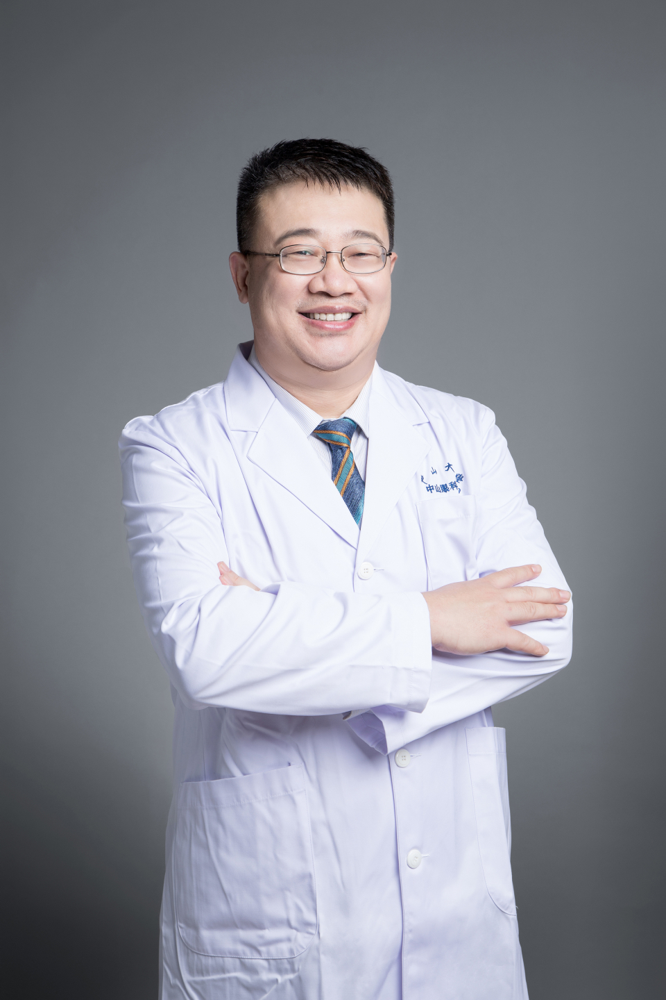

<!-- AUTO-GENERATED-BY: work/generate_obsidian_profiles.py -->

# 李涛

## 基础信息

| 字段 | 内容 |
|---|---|
| 医院 | 中山大学中山眼科中心 |
| 姓名 | 李涛 |
| 科室 | 眼底疾病 |
| 职称/身份 | 教授 |
| 重点优先级 | 高 |
| 来源类型 | 医院官网 |
| 来源链接 | [官网原文](http://www.gzzoc.org.cn/node/3142) |
| 采集日期 | 2026-08-09 |
| 复核状态 | 待人工复核 |
| 异常提示 |  |

## 简介/擅长

擅长各种眼底疾病的诊治，尤其是视网膜脱离、糖尿病视网膜病变、黄斑裂孔、黄斑前膜、老年性黄斑变性、眼内肿瘤、先天性视网膜劈裂等的诊断、手术和激光治疗。

## 详情正文摘录

教授，主任医师，博士研究生导师，中山大学中山眼科中心副主任。担任国家眼科质控中心（筹）委员、眼底病学组组长，国家卫健委医疗应急工作眼科专家组成员，中国微循环学会眼微循环专委会副主任委员，海医会视网膜血管病学组副组长，广东省卫健委医疗应急工作眼科工作组组长，广东省眼科质控中心副主任委员，广东省医学会激光医学分会副主任委员、眼科学分会眼外伤组长、黄斑病学组副组长，广东省医师协会眼科学分会青年学组副主委。

## 重点关注范围

- 慢性病
- 肿瘤

## 重点疾病标签

- 糖尿病
- 肿瘤

## 亮眼经历线索

- 教授，主任医师，博士研究生导师，中山大学中山眼科中心副主任。
- 担任国家眼科质控中心（筹）委员、眼底病学组组长，国家卫健委医疗应急工作眼科专家组成员，中国微循环学会眼微循环专委会副主任委员，海医会视网膜血管病学组副组长，广东省卫健委医疗应急工作眼科工作组组长，广东省眼科质控中心副主任委员，广东省医学会激光医学分会副主任委员、眼科学分会眼外伤组长、黄斑病学组副组长，广东省医师协会眼科学分会青年学组副主委。

## 异常提示

## 合规边界

- 本画像仅整理统一总底表中的医院官网公开字段。
- 不包含患者评价、排名、第三方来源内容或疗效承诺。
- 官网未展示的信息保持空白，后续如需补充须回到底表官方来源字段。
