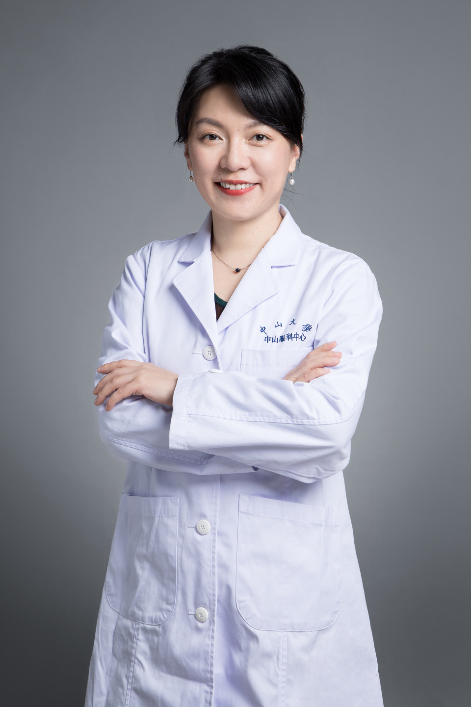

<!-- AUTO-GENERATED-BY: work/generate_obsidian_profiles.py -->

# 杨晓

## 基础信息

| 字段 | 内容 |
|---|---|
| 医院 | 中山大学中山眼科中心 |
| 姓名 | 杨晓 |
| 科室 | 近视防控、屈光矫正、视觉发育 |
| 职称/身份 | 教授 |
| 重点优先级 | 高 |
| 来源类型 | 医院官网 |
| 来源链接 | [官网原文](http://www.gzzoc.org.cn/node/3206) |
| 采集日期 | 2026-08-09 |
| 复核状态 | 待人工复核 |
| 异常提示 |  |

## 简介/擅长

擅长儿童青少年近视和弱视诊治，致力于近视的发病机制及角膜塑形术防治研究。对圆锥角膜、屈光手术等术后不规则角膜散光问题，对角膜接触镜的临床应用和并发症诊治具有丰富经验，尤其擅于对疑难屈光不正问题进行个体化综合诊疗。

## 详情正文摘录

医学博士 屈光与青少年近视防控科主任 研究生导师 中华医学会眼科学分会眼视光学组 副组长 国际角膜塑形学会亚洲分会 资深会员考委会负责人 中国医促会视觉健康分会青委会 副主任委员 中国妇幼保健协会 儿童眼保健专委会委员 海峡两岸医药卫生交流协会眼科学专委会委员 广东省视光学学会接触镜专委会 主任委员 2018年首批人才项目“广东省杰出青年医学人才” 主持国家自然科学基金及省部级课题多项。主编及编写多部眼科及视光学教材，发表SCI论文多篇。《中华眼视光学与视觉科学杂志》、《中山大学学报》、《Contact Lens and Anterior Eye》、《Translational Vision Science & Technology》等审稿专家

## 重点关注范围

- 术后恢复/康复
- 疑难重症

## 重点疾病标签

- 术后
- 疑难

## 亮眼经历线索

- 对圆锥角膜、屈光手术等术后不规则角膜散光问题，对角膜接触镜的临床应用和并发症诊治具有丰富经验，尤其擅于对疑难屈光不正问题进行个体化综合诊疗。
- 医学博士 屈光与青少年近视防控科主任 研究生导师 中华医学会眼科学分会眼视光学组 副组长 国际角膜塑形学会亚洲分会 资深会员考委会负责人 中国医促会视觉健康分会青委会 副主任委员 中国妇幼保健协会 儿童眼保健专委会委员 海峡两岸医药卫生交流协会眼科学专委会委员 广东省视光学学会接触镜专委会 主任委员 2018年首批人才项目“广东省杰出青年医学人才” 主持国…
- 主编及编写多部眼科及视光学教材，发表SCI论文多篇。

## 异常提示

## 合规边界

- 本画像仅整理统一总底表中的医院官网公开字段。
- 不包含患者评价、排名、第三方来源内容或疗效承诺。
- 官网未展示的信息保持空白，后续如需补充须回到底表官方来源字段。
