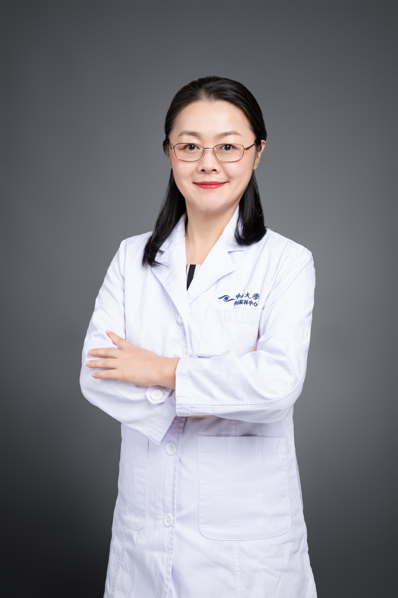

<!-- AUTO-GENERATED-BY: work/generate_obsidian_profiles.py -->

# 林英

## 基础信息

| 字段 | 内容 |
|---|---|
| 医院 | 中山大学中山眼科中心 |
| 姓名 | 林英 |
| 科室 | 玻璃体、视网膜视神经疾病 |
| 职称/身份 | 主任医师 |
| 重点优先级 | 高 |
| 来源类型 | 医院官网 |
| 来源链接 | [官网原文](http://www.gzzoc.org.cn/node/3181) |
| 采集日期 | 2026-08-09 |
| 复核状态 | 待人工复核 |
| 异常提示 |  |

## 简介/擅长

擅长各种眼底疾病的诊治，例如：糖尿病视网膜病变、视网膜静脉阻塞、黄斑部病变、视神经炎、葡萄膜炎、病毒性视网膜炎、玻璃体疾病和眼睑痉挛等疑难眼病临床诊断和治疗；针对眼底新生血管性疾病的抗VEGF药物治疗；遗传性视网膜罕见疾病的诊断和治疗等。

## 详情正文摘录

主任医师、医学博士，硕士研究生导师，毕业于中山大学中山眼科中心，广东省女职工素质教育高级讲师，国家公派访问学者在全美连续排名第一的Bascom Palmer Eye Institute和Shiley Eye Institute访问学习，对于眼科前沿的OCT、RFI影像学进展，眼底疾病诊治技术积累了一定的经验。广东省医学会影像技术学会委员，广东省眼健康协会眼与全身病专业委员会副主任委员，广东省眼健康协会眼底病专委会常委。 发表NEJM、BMJ、IOVS等SCI及国内外核心期刊杂志收录文章50篇；主持国家自然科学基金青年项目1项，广东省医学科学技术研究1项，广州市基础研究计划市校（院）联合资助项目1项；参与国家级省级基金9项。主编《中山眼底病疑难病例解析》，获得2021年“国家科学技术学术著作出版基金”；2022年获得“广东省柯麟医学教育基金会优秀临床带教老师”称号。2023年获得“新医科”视域下课程思政案例三等奖。2024年获得中山大学第十二届教师教学竞赛创新赛道副高及以上组二等奖。

## 重点关注范围

- 慢性病
- 疑难重症

## 重点疾病标签

- 糖尿病
- 疑难
- 罕见

## 亮眼经历线索

- 主任医师 擅长各种眼底疾病的诊治，例如：糖尿病视网膜病变、视网膜静脉阻塞、黄斑部病变、视神经炎、葡萄膜炎、病毒性视网膜炎、玻璃体疾病和眼睑痉挛等疑难眼病临床诊断和治疗；

## 异常提示

## 合规边界

- 本画像仅整理统一总底表中的医院官网公开字段。
- 不包含患者评价、排名、第三方来源内容或疗效承诺。
- 官网未展示的信息保持空白，后续如需补充须回到底表官方来源字段。
