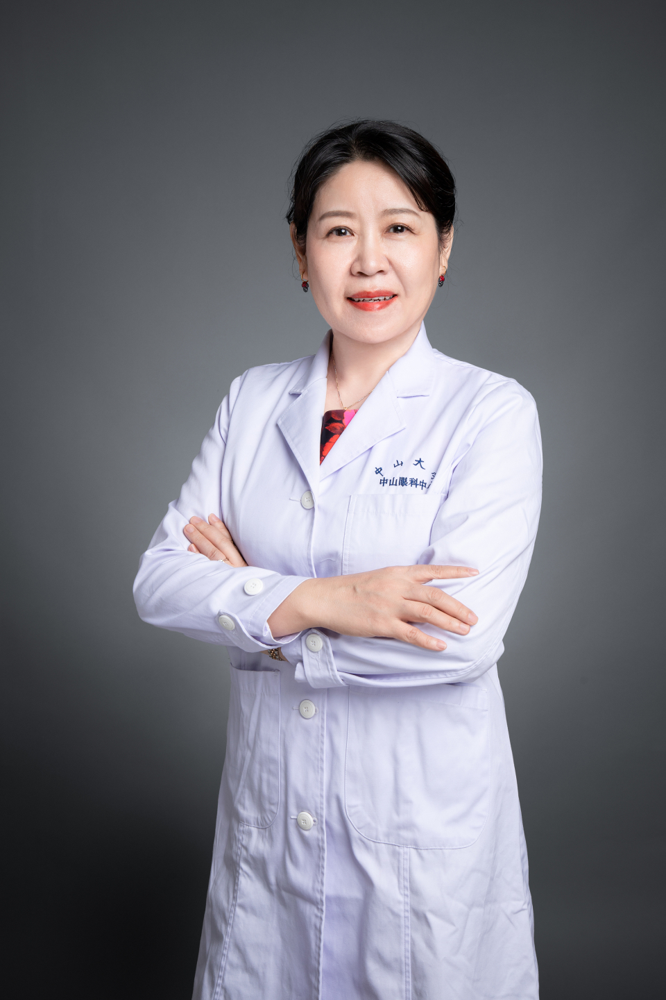

<!-- AUTO-GENERATED-BY: work/generate_obsidian_profiles.py -->

# 梁丹

## 基础信息

| 字段 | 内容 |
|---|---|
| 医院 | 中山大学中山眼科中心 |
| 姓名 | 梁丹 |
| 科室 | 眼免疫与葡萄膜炎 |
| 职称/身份 | 教授 |
| 重点优先级 | 高 |
| 来源类型 | 医院官网 |
| 来源链接 | [官网原文](http://www.gzzoc.org.cn/node/3116) |
| 采集日期 | 2026-08-09 |
| 复核状态 | 待人工复核 |
| 异常提示 |  |

## 简介/擅长

擅长各种常见及难治葡萄膜炎、巩膜炎、甲状腺相关眼病、炎性假瘤、过敏性结膜炎以及免疫性角膜疾病等眼免疫炎症性疾病的诊断和治疗。对常见及难治眼底疾病，如：视网膜色素变性、视网膜静脉周围炎等具有多种丰富经验。擅长将最新研究结果应用于临床实践，进而获得更佳的临床获益。

## 详情正文摘录

于中山大学中山眼科中心从事眼科临床、教学、科研30余年。 中华医学会眼科学免疫学组委员 中华医学会医学科研管理分会委员 广东省医学会细胞治疗分会常委

## 重点关注范围

- 肿瘤
- 免疫/风湿/感染
- 疑难重症

## 重点疾病标签

- 瘤
- 免疫
- 难治

## 亮眼经历线索

- 中华医学会眼科学免疫学组委员 中华医学会医学科研管理分会委员 广东省医学会细胞治疗分会常委

## 异常提示

## 合规边界

- 本画像仅整理统一总底表中的医院官网公开字段。
- 不包含患者评价、排名、第三方来源内容或疗效承诺。
- 官网未展示的信息保持空白，后续如需补充须回到底表官方来源字段。
