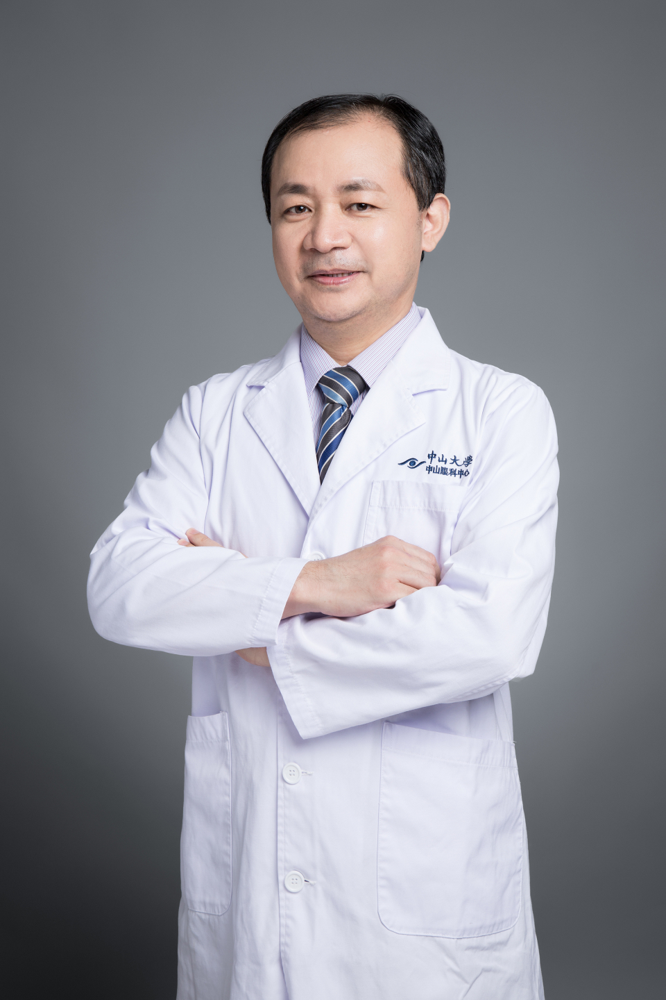

<!-- AUTO-GENERATED-BY: work/generate_obsidian_profiles.py -->

# 梁轩伟

## 基础信息

| 字段 | 内容 |
|---|---|
| 医院 | 中山大学中山眼科中心 |
| 姓名 | 梁轩伟 |
| 科室 | 眼整形与泪器病 |
| 职称/身份 | 主任医师 |
| 重点优先级 | 高 |
| 来源类型 | 医院官网 |
| 来源链接 | [官网原文](http://www.gzzoc.org.cn/node/3101) |
| 采集日期 | 2026-08-09 |
| 复核状态 | 待人工复核 |
| 异常提示 |  |

## 简介/擅长

能开展各类型眼部整形美容手术，擅长于眼鼻相关疾病如应用鼻内窥镜及泪道内窥镜治疗急慢性泪囊炎、各类型阻塞性泪道疾病，尤其在陈旧性及复杂性急诊外伤性泪小管断裂损伤与修复的手术功能重建，先天及外伤性无泪道的结构再造与功能重建等方面积累了较丰富的临床经验。

## 详情正文摘录

医学博士，主任医师，硕士研究生导师，眼整形与泪道科主任。能开展各类型眼部整形美容手术，擅长于眼鼻相关疾病如应用鼻内窥镜及泪道内窥镜治疗急慢性泪囊炎、各类型阻塞性泪道疾病，尤其在陈旧性及复杂性急诊外伤性泪小管断裂损伤与修复的手术功能重建，先天及外伤性无泪道的结构再造与功能重建等方面积累了较丰富的临床经验。

## 重点关注范围

- 慢性病
- 疑难重症

## 重点疾病标签

- 慢性
- 复杂

## 亮眼经历线索

- 主任医师 主任医师 医学博士，主任医师，硕士研究生导师，眼整形与泪道科主任。

## 异常提示

## 合规边界

- 本画像仅整理统一总底表中的医院官网公开字段。
- 不包含患者评价、排名、第三方来源内容或疗效承诺。
- 官网未展示的信息保持空白，后续如需补充须回到底表官方来源字段。
