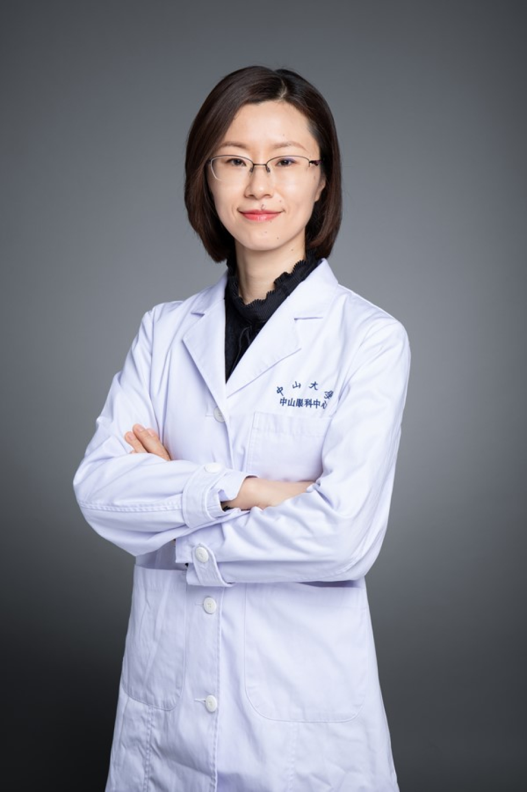

<!-- AUTO-GENERATED-BY: work/generate_obsidian_profiles.py -->

# 沈卫华

## 基础信息

| 字段 | 内容 |
|---|---|
| 医院 | 中山大学中山眼科中心 |
| 姓名 | 沈卫华 |
| 科室 | 麻醉 |
| 职称/身份 | 副主任医师 |
| 重点优先级 | 中 |
| 来源类型 | 医院官网 |
| 来源链接 | [官网原文](http://www.gzzoc.org.cn/node/6743) |
| 采集日期 | 2026-08-09 |
| 复核状态 | 待人工复核 |
| 异常提示 |  |

## 简介/擅长

擅长小儿麻醉。

## 详情正文摘录

副主任医师。1997年毕业于中山医科大学临床医疗系本科，2010年取得硕士学位。1997-2006年于广州军区157中心医院麻醉科工作，2006年转业至中山大学中山眼科中心。长年工作于麻醉临床一线，积累了较为丰富的工作经验，擅长小儿麻醉。

## 重点关注范围

## 重点疾病标签

## 亮眼经历线索

- 副主任医师 副主任医师 副主任医师。

## 异常提示

## 合规边界

- 本画像仅整理统一总底表中的医院官网公开字段。
- 不包含患者评价、排名、第三方来源内容或疗效承诺。
- 官网未展示的信息保持空白，后续如需补充须回到底表官方来源字段。
