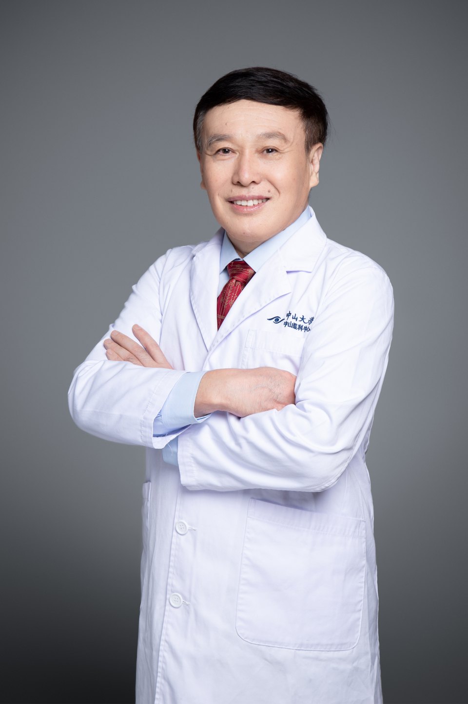

<!-- AUTO-GENERATED-BY: work/generate_obsidian_profiles.py -->

# 王智崇

## 基础信息

| 字段 | 内容 |
|---|---|
| 医院 | 中山大学中山眼科中心 |
| 姓名 | 王智崇 |
| 科室 | 角膜病、干眼与眼表疾病 |
| 职称/身份 | 教授 |
| 重点优先级 | 中 |
| 来源类型 | 医院官网 |
| 来源链接 | [官网原文](http://www.gzzoc.org.cn/node/3134) |
| 采集日期 | 2026-08-09 |
| 复核状态 | 待人工复核 |
| 异常提示 |  |

## 简介/擅长

擅长诊治各类角膜疾病和泪道阻塞性疾病，眼表干细胞治疗

## 详情正文摘录

医学博士、主任医师、教授、博士研究生导师、出站博士后。 从事角膜病和泪道阻塞性疾病的医、教、研35年，1997年开设我国第一个泪道病门诊，第一个研发生物角膜和眼科干细胞治疗。 中山大学中山眼科中心角膜病科前主任，眼科学国家重点实验室PI，眼表实验室主任，2013年度科学中国人，中华医师学会角膜学组委员，中华医学科技奖评审委员，卫生部眼科内窥镜专业委员会常务理事，中国生物医学工程学会组织工程与再生医学分会常务委员，广东省眼表屈光专业委员会主任委员，广东省基层医药学会眼科分委会主委，广东省人体组织工程学会常务理事。Cornea、IOVS、Tissue Eng、BJO、AJO、Biomaterials等杂志审稿人。 现主持“国家重点研发项目”一项、主持完成国家“973”、863计划5项、国家科技攻关计划2项、国家自然科学基金2项，获国家发明专利授权18项，获得医疗器械产品注册证5项，获得各类科技成果奖6项。

## 重点关注范围

## 重点疾病标签

## 亮眼经历线索

- 医学博士、主任医师、教授、博士研究生导师、出站博士后。
- 中山大学中山眼科中心角膜病科前主任，眼科学国家重点实验室PI，眼表实验室主任，2013年度科学中国人，中华医师学会角膜学组委员，中华医学科技奖评审委员，卫生部眼科内窥镜专业委员会常务理事，中国生物医学工程学会组织工程与再生医学分会常务委员，广东省眼表屈光专业委员会主任委员，广东省基层医药学会眼科分委会主委，广东省人体组织工程学会常务理事。
- 现主持“国家重点研发项目”一项、主持完成国家“973”、863计划5项、国家科技攻关计划2项、国家自然科学基金2项，获国家发明专利授权18项，获得医疗器械产品注册证5项，获得各类科技成果奖6项。

## 异常提示

## 合规边界

- 本画像仅整理统一总底表中的医院官网公开字段。
- 不包含患者评价、排名、第三方来源内容或疗效承诺。
- 官网未展示的信息保持空白，后续如需补充须回到底表官方来源字段。
