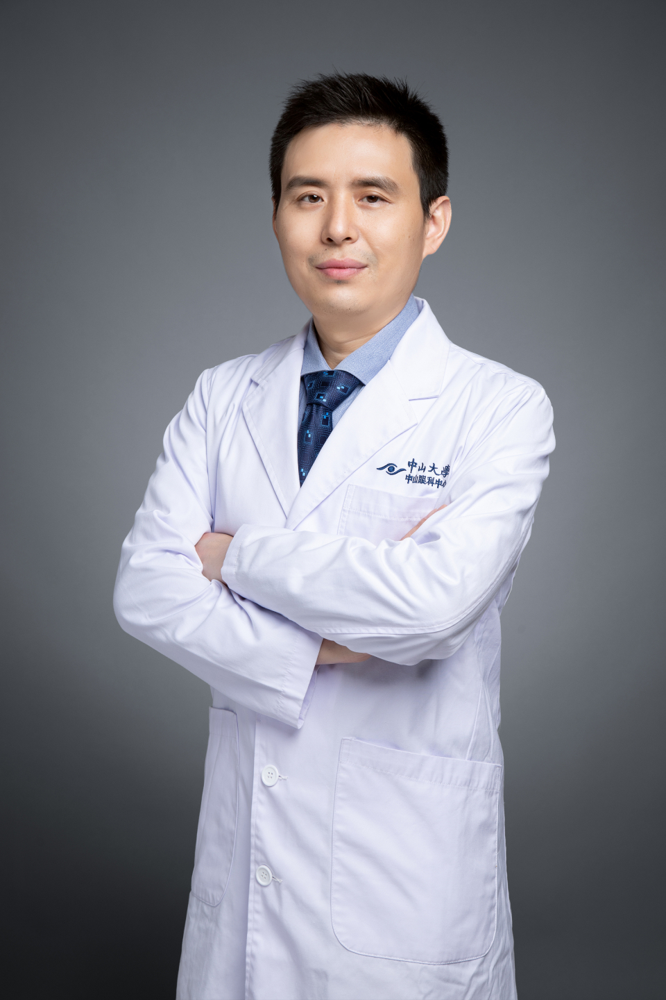

<!-- AUTO-GENERATED-BY: work/generate_obsidian_profiles.py -->

# 甘小亮

## 基础信息

| 字段 | 内容 |
|---|---|
| 医院 | 中山大学中山眼科中心 |
| 姓名 | 甘小亮 |
| 科室 | 麻醉 |
| 职称/身份 | 主任医师 |
| 重点优先级 | 高 |
| 来源类型 | 医院官网 |
| 来源链接 | [官网原文](http://www.gzzoc.org.cn/node/6739) |
| 采集日期 | 2026-08-09 |
| 复核状态 | 待人工复核 |
| 异常提示 |  |

## 简介/擅长

小儿麻醉，危重病人的围术期监测与治疗。

## 详情正文摘录

麻醉学博士学位。 手术室、麻醉科主任，博士生导师，广东省首批杰出青年医学人才。 研究方向：小儿麻醉与镇静，疼痛及痛觉过敏的诊疗。其中4篇眼科麻醉临床研究发表在麻醉专业影响力排名第一（JCA）及（BJA）第二杂志。主持国家自然科学基金2项。 广东省医学会麻醉学分会眼耳鼻喉麻醉学组组长。

## 重点关注范围

- 术后恢复/康复
- 疑难重症

## 重点疾病标签

- 疼痛
- 危重

## 亮眼经历线索

- 主任医师 小儿麻醉，危重病人的围术期监测与治疗。

## 异常提示

## 合规边界

- 本画像仅整理统一总底表中的医院官网公开字段。
- 不包含患者评价、排名、第三方来源内容或疗效承诺。
- 官网未展示的信息保持空白，后续如需补充须回到底表官方来源字段。
