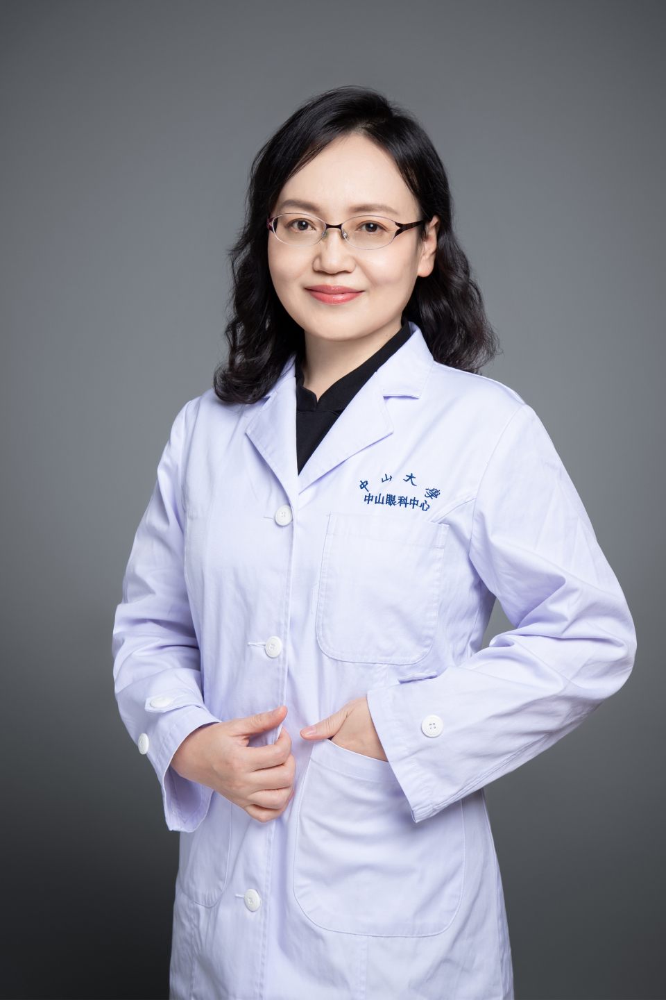

<!-- AUTO-GENERATED-BY: work/generate_obsidian_profiles.py -->

# 罗莉霞

## 基础信息

| 字段 | 内容 |
|---|---|
| 医院 | 中山大学中山眼科中心 |
| 姓名 | 罗莉霞 |
| 科室 | 白内障 |
| 职称/身份 | 教授 |
| 重点优先级 | 高 |
| 来源类型 | 医院官网 |
| 来源链接 | [官网原文](http://www.gzzoc.org.cn/node/3265) |
| 采集日期 | 2026-08-09 |
| 复核状态 | 待人工复核 |
| 异常提示 |  |

## 简介/擅长

擅长各种类型白内障超声乳化联合人工晶状体植入术，尤其是硬核白内障、先天性白内障、外伤性白内障等复杂白内障。

## 详情正文摘录

每周一下午出高端特诊 (门诊诊查费、检查、治疗、手术等按特需服务价格收费) 。 教授，主任医师，博士生导师，美国 wilmer眼科中心访问学者 ，白内障科主任，获第十一届 “全国优秀眼科医师”称号。广东省医学会眼科学分会白内障学组 副组长 ，广东省视光学会屈光性白内障专委会 副主任委员 ；对高度近视、准分子激光术后、玻璃体切除术后等复杂白内障手术及人工晶状体屈光力计算有丰富的临床经验；主持 4项国家自然科学基金面上项目； 在 国内外医学期刊 发表 研究成果 1 00 多篇 。

## 重点关注范围

- 术后恢复/康复
- 疑难重症

## 重点疾病标签

- 术后
- 复杂

## 亮眼经历线索

- 教授，主任医师，博士生导师，美国 wilmer眼科中心访问学者 ，白内障科主任，获第十一届 “全国优秀眼科医师”称号。
- 广东省医学会眼科学分会白内障学组 副组长 ，广东省视光学会屈光性白内障专委会 副主任委员 ；
- 主持 4项国家自然科学基金面上项目；
- 在 国内外医学期刊 发表 研究成果 1 00 多篇 。

## 异常提示

## 合规边界

- 本画像仅整理统一总底表中的医院官网公开字段。
- 不包含患者评价、排名、第三方来源内容或疗效承诺。
- 官网未展示的信息保持空白，后续如需补充须回到底表官方来源字段。
