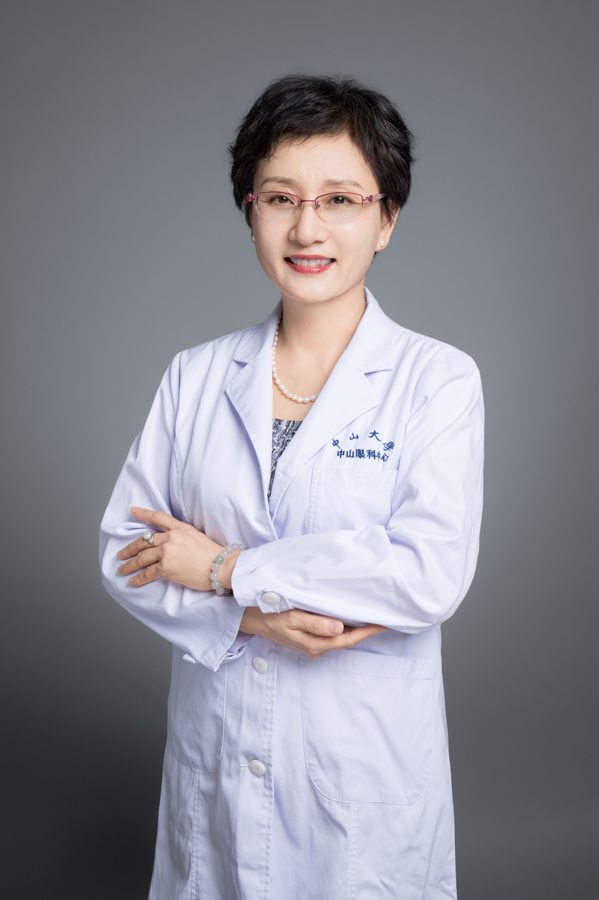

<!-- AUTO-GENERATED-BY: work/generate_obsidian_profiles.py -->

# 艾思明

## 基础信息

| 字段 | 内容 |
|---|---|
| 医院 | 中山大学中山眼科中心 |
| 姓名 | 艾思明 |
| 科室 | 眼眶病与眼肿瘤 |
| 职称/身份 | 副主任医师 |
| 重点优先级 | 高 |
| 来源类型 | 医院官网 |
| 来源链接 | [官网原文](http://www.gzzoc.org.cn/node/3122) |
| 采集日期 | 2026-08-09 |
| 复核状态 | 待人工复核 |
| 异常提示 |  |

## 简介/擅长

擅长于眼眶病、眼部肿瘤的诊治，尤其是甲状腺相关疾病，眼球突出，眼睑、结膜肿瘤和成形，手术后化疗等

## 详情正文摘录

从事眼科临床工作30年，擅长多种眼科疾病，尤其各种眼眶病，眼肿瘤的诊断和治疗，如甲状腺相关眼病，视网膜母细胞瘤的综合个体治疗，各种眼眶病，眼肿瘤手术，眼球突出，眼睑，结膜，眼眶肿瘤手术切除和术后成形，术后化疗等均具丰富的临床经验。

## 重点关注范围

- 肿瘤
- 术后恢复/康复

## 重点疾病标签

- 肿瘤
- 瘤
- 化疗
- 术后

## 亮眼经历线索

- 副主任医师 副主任医师

## 异常提示

## 合规边界

- 本画像仅整理统一总底表中的医院官网公开字段。
- 不包含患者评价、排名、第三方来源内容或疗效承诺。
- 官网未展示的信息保持空白，后续如需补充须回到底表官方来源字段。
