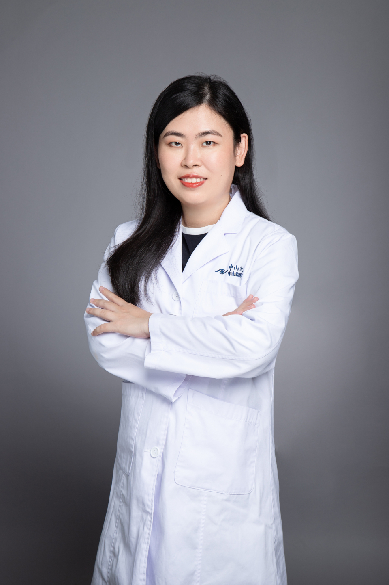

<!-- AUTO-GENERATED-BY: work/generate_obsidian_profiles.py -->

# 蒋欣桐

## 基础信息

| 字段 | 内容 |
|---|---|
| 医院 | 中山大学中山眼科中心 |
| 姓名 | 蒋欣桐 |
| 科室 | 眼底疾病 |
| 职称/身份 | 主治医师 |
| 重点优先级 | 高 |
| 来源类型 | 医院官网 |
| 来源链接 | [官网原文](http://www.gzzoc.org.cn/node/3154) |
| 采集日期 | 2026-08-09 |
| 复核状态 | 待人工复核 |
| 异常提示 |  |

## 简介/擅长

擅长各种眼底疾病的诊治，尤其是糖尿病视网膜病变、黄斑疾病、各种类型视网膜脱离的诊断和治疗。

## 详情正文摘录

博士毕业于中山大学中山眼科中心，从事眼科临床和科研工作十几年，对各类眼底病，包括糖尿病视网膜病变、黄斑疾病、各种类型视网膜脱离等眼底疾病的诊疗具有一定的临床经验。参与《临床眼底病.外科卷》等眼底病著作的编写，参与了多项国家自然科学基金和广东省自然科学基金研究，获得国家发明专利2项，2020年获得广东省科技进步奖二等奖。

## 重点关注范围

- 慢性病

## 重点疾病标签

- 糖尿病

## 亮眼经历线索

- 参与《临床眼底病.外科卷》等眼底病著作的编写，参与了多项国家自然科学基金和广东省自然科学基金研究，获得国家发明专利2项，2020年获得广东省科技进步奖二等奖。

## 异常提示

## 合规边界

- 本画像仅整理统一总底表中的医院官网公开字段。
- 不包含患者评价、排名、第三方来源内容或疗效承诺。
- 官网未展示的信息保持空白，后续如需补充须回到底表官方来源字段。
