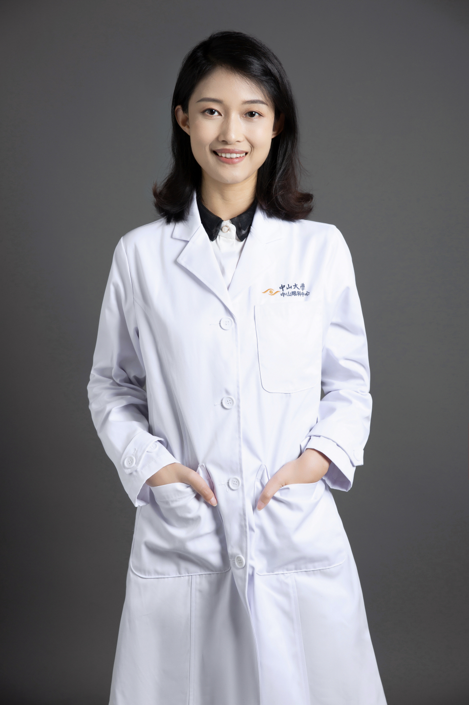

<!-- AUTO-GENERATED-BY: work/generate_obsidian_profiles.py -->

# 许吉萍

## 基础信息

| 字段 | 内容 |
|---|---|
| 医院 | 中山大学中山眼科中心 |
| 姓名 | 许吉萍 |
| 科室 | 近视防控、屈光矫正、视觉发育 |
| 职称/身份 | 主治医师 |
| 重点优先级 | 中 |
| 来源类型 | 医院官网 |
| 来源链接 | [官网原文](http://www.gzzoc.org.cn/node/3209) |
| 采集日期 | 2026-08-09 |
| 复核状态 | 待人工复核 |
| 异常提示 |  |

## 简介/擅长

擅长儿童青少年近视的诊治及防控方案指导，远视、散光和弱视的矫治，OK镜及其他接触镜验配，成人屈光手术咨询以及圆锥角膜的诊治等。

## 详情正文摘录

中山大学眼科博士，擅长儿童青少年近视的诊治及防控方案指导，远视、散光和弱视的矫治，OK镜及其他接触镜验配，成人屈光手术咨询以及圆锥角膜的诊治等。

## 重点关注范围

## 重点疾病标签

## 亮眼经历线索

## 异常提示

## 合规边界

- 本画像仅整理统一总底表中的医院官网公开字段。
- 不包含患者评价、排名、第三方来源内容或疗效承诺。
- 官网未展示的信息保持空白，后续如需补充须回到底表官方来源字段。
