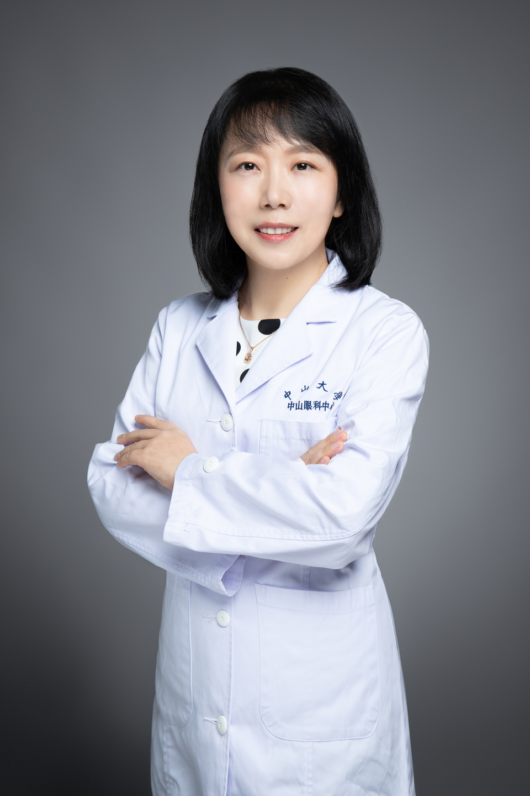

<!-- AUTO-GENERATED-BY: work/generate_obsidian_profiles.py -->

# 谈旭华

## 基础信息

| 字段 | 内容 |
|---|---|
| 医院 | 中山大学中山眼科中心 |
| 姓名 | 谈旭华 |
| 科室 | 白内障 |
| 职称/身份 | 副主任医师 |
| 重点优先级 | 中 |
| 来源类型 | 医院官网 |
| 来源链接 | [官网原文](http://www.gzzoc.org.cn/node/3269) |
| 采集日期 | 2026-08-09 |
| 复核状态 | 待人工复核 |
| 异常提示 |  |

## 简介/擅长

擅长白内障超声乳化术、手法小切口白内障摘除术,多焦点人工晶状体及散光矫正型人工晶状体植入等屈光性白内障手术。

## 详情正文摘录

眼科学博士,哈佛医学院麻省眼耳医院博士后，副主任医师，硕士生导师。中国医疗保健国际交流促进会眼科学分会青年委员，中山大学中山眼科中心白内障专科医师。从事白内障临床和科研工作15年，擅长白内障超声乳化术、小切口白内障摘除术、多焦点人工晶状体及散光矫正型人工晶状体植入等屈光性白内障手术。主要研究方向为白内障防治和发病机制研究，目前主持国家自然科学基金2项，广东省自然科学基金2项，参与多项国家自然科学基金重点项目和国家重点研发计划，参与编写白内障专著2部，在国内外杂志上发表高质量科研论文40余篇，其中以第一作者或通讯作者发表SCI论文14篇（IF>10分2篇）。曾参加国家卫计委健康快车白内障防盲扶贫项目，多次获得中山眼科中心“科研贡献奖”和“防盲贡献奖”。为白内障专科规培医生，专科医生和进修医生超声乳化培训项目的授课老师，为中山医五年制临床本科生的眼科学见习带教老师。

## 重点关注范围

## 重点疾病标签

## 亮眼经历线索

- 副主任医师 副主任医师 眼科学博士,哈佛医学院麻省眼耳医院博士后，副主任医师，硕士生导师。
- 主要研究方向为白内障防治和发病机制研究，目前主持国家自然科学基金2项，广东省自然科学基金2项，参与多项国家自然科学基金重点项目和国家重点研发计划，参与编写白内障专著2部，在国内外杂志上发表高质量科研论文40余篇，其中以第一作者或通讯作者发表SCI论文14篇（IF>10分2篇）。

## 异常提示

## 合规边界

- 本画像仅整理统一总底表中的医院官网公开字段。
- 不包含患者评价、排名、第三方来源内容或疗效承诺。
- 官网未展示的信息保持空白，后续如需补充须回到底表官方来源字段。
