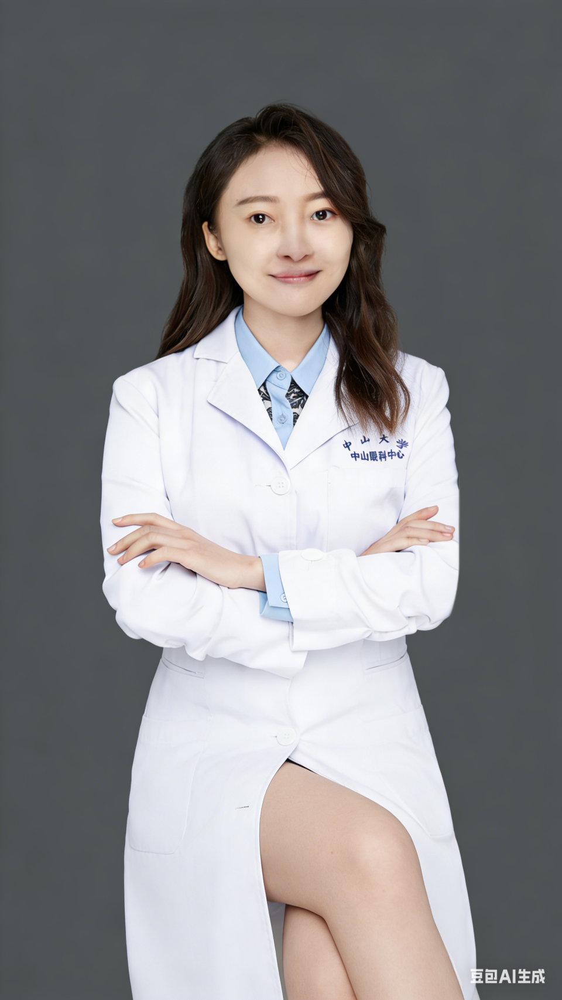

<!-- AUTO-GENERATED-BY: work/generate_obsidian_profiles.py -->

# 邓宇晴

## 基础信息

| 字段 | 内容 |
|---|---|
| 医院 | 中山大学中山眼科中心 |
| 姓名 | 邓宇晴 |
| 科室 | 眼整形与泪器病 |
| 职称/身份 | 医师 |
| 重点优先级 | 普通 |
| 来源类型 | 医院官网 |
| 来源链接 | [官网原文](http://www.gzzoc.org.cn/node/14197) |
| 采集日期 | 2026-08-09 |
| 复核状态 | 待人工复核 |
| 异常提示 |  |

## 简介/擅长

常见眼整形手术，泪道疾病、眼表疾病的诊断与治疗

## 详情正文摘录

眼科学博士，硕士、博士均毕业于中山大学，中山大学博士后，美国迈阿密大学-巴斯科姆帕尔默（Bascom Palmer）眼科研究所访问学者。主持国家自然科学基金，中国博士后面上基金，中山大学高校培育项目等多项课题。致力于眼表与泪器疾病精准诊疗，眼部影像标志物探索等研究，在相关领域发表权威SCI二十余篇。曾获广东省科技进步一等奖，第一届大湾区博士博士后创新创业大赛中山大学校区银奖等。

## 重点关注范围

## 重点疾病标签

## 亮眼经历线索

- 眼科学博士，硕士、博士均毕业于中山大学，中山大学博士后，美国迈阿密大学-巴斯科姆帕尔默（Bascom Palmer）眼科研究所访问学者。
- 主持国家自然科学基金，中国博士后面上基金，中山大学高校培育项目等多项课题。
- 致力于眼表与泪器疾病精准诊疗，眼部影像标志物探索等研究，在相关领域发表权威SCI二十余篇。
- 曾获广东省科技进步一等奖，第一届大湾区博士博士后创新创业大赛中山大学校区银奖等。

## 异常提示

## 合规边界

- 本画像仅整理统一总底表中的医院官网公开字段。
- 不包含患者评价、排名、第三方来源内容或疗效承诺。
- 官网未展示的信息保持空白，后续如需补充须回到底表官方来源字段。
