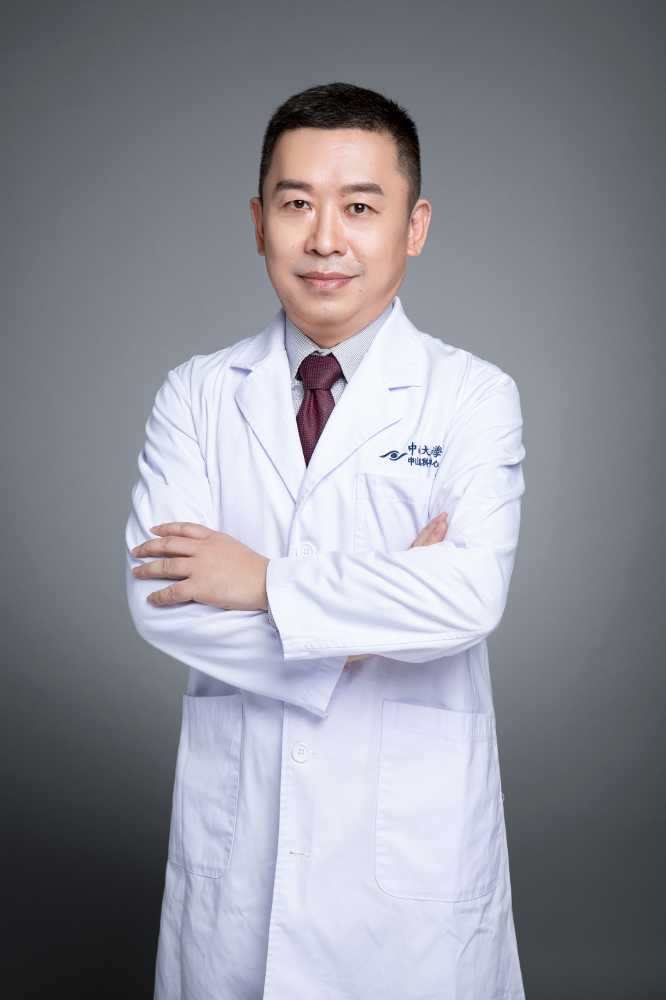

<!-- AUTO-GENERATED-BY: work/generate_obsidian_profiles.py -->

# 邵应峰

## 基础信息

| 字段 | 内容 |
|---|---|
| 医院 | 中山大学中山眼科中心 |
| 姓名 | 邵应峰 |
| 科室 | 角膜病、干眼与眼表疾病 |
| 职称/身份 | 副主任医师 |
| 重点优先级 | 中 |
| 来源类型 | 医院官网 |
| 来源链接 | [官网原文](http://www.gzzoc.org.cn/node/3239) |
| 采集日期 | 2026-08-09 |
| 复核状态 | 待人工复核 |
| 异常提示 |  |

## 简介/擅长

擅长角膜移植，人工角膜、泪道、眼整形等眼表角膜手术以及青光眼、白内障等眼前段手术。

## 详情正文摘录

医学博士，副主任医师。专业特长为眼表、角膜疾病诊治。擅长角膜移植，人工角膜、泪道、眼整形等眼表角膜手术以及青光眼、白内障等眼前段手术。 1998年起于中山大学中山眼科中心师从我国著名角膜病专家陈家祺教授，主攻角膜及眼表疾病的防治并获博士学位。曾受凯思奖学金海外研究资助项目资助往美国New York Eye & Ear Infirmary师从国际著名眼科专家Danning Hu教授，从事合作研究并进修学习。主持并完成国家自然科学基金等10余科研项目。在专业学术刊物发表论文14篇。参与编写专著一部。

## 重点关注范围

## 重点疾病标签

## 亮眼经历线索

- 副主任医师 副主任医师 医学博士，副主任医师。
- 曾受凯思奖学金海外研究资助项目资助往美国New York Eye & Ear Infirmary师从国际著名眼科专家Danning Hu教授，从事合作研究并进修学习。

## 异常提示

## 合规边界

- 本画像仅整理统一总底表中的医院官网公开字段。
- 不包含患者评价、排名、第三方来源内容或疗效承诺。
- 官网未展示的信息保持空白，后续如需补充须回到底表官方来源字段。
