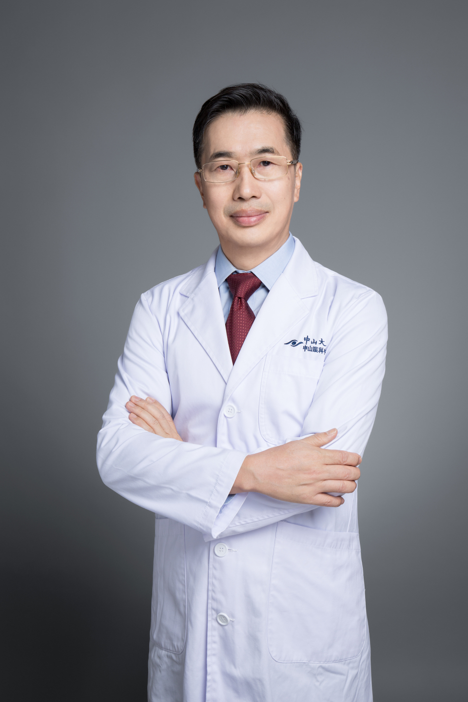

<!-- AUTO-GENERATED-BY: work/generate_obsidian_profiles.py -->

# 郑永欣

## 基础信息

| 字段 | 内容 |
|---|---|
| 医院 | 中山大学中山眼科中心 |
| 姓名 | 郑永欣 |
| 科室 | 眼科急症、眼外伤 |
| 职称/身份 | 主任医师 |
| 重点优先级 | 高 |
| 来源类型 | 医院官网 |
| 来源链接 | [官网原文](http://www.gzzoc.org.cn/node/3108) |
| 采集日期 | 2026-08-09 |
| 复核状态 | 待人工复核 |
| 异常提示 |  |

## 简介/擅长

擅长各种眼外伤的诊断和治疗，包括视神经损伤、眼内/眶内异物、复杂外伤性眼眶骨折、复杂外伤眼睑畸形、外伤性白内障、眼内炎、复杂视网膜损伤，及各种眼部整形美容手术包括先天性眼睑发育不良、睑内外翻、结膜穹隆狭窄等。尤其对复杂眼损伤抢救、治疗有丰富的临床经验，并已开展人工玻璃体球囊植入手术。

## 详情正文摘录

硕士研究生导师。从事眼科医，教，研工作30年。擅长各种眼外伤的诊断和治疗，包括视神经损伤、眼内/眶内异物、复杂外伤性眼眶骨折、复杂外伤眼睑畸形、外伤性白内障、眼内炎、复杂视网膜损伤，及各种眼部整形美容手术包括先天性眼睑发育不良、睑内外翻、结膜穹隆狭窄等。尤其对复杂眼损伤抢救、治疗有丰富的临床经验，并已开展人工玻璃体球囊植入手术。主要研究方向视神经损伤的保护和修复，负责多项国家及广东省自然科学基金项目，已发表国内外学术论文30余篇。

## 重点关注范围

- 疑难重症

## 重点疾病标签

- 复杂

## 亮眼经历线索

- 主任医师 主任医师 主要研究方向视神经损伤的保护和修复，负责多项国家及广东省自然科学基金项目，已发表国内外学术论文30余篇。

## 异常提示

## 合规边界

- 本画像仅整理统一总底表中的医院官网公开字段。
- 不包含患者评价、排名、第三方来源内容或疗效承诺。
- 官网未展示的信息保持空白，后续如需补充须回到底表官方来源字段。
