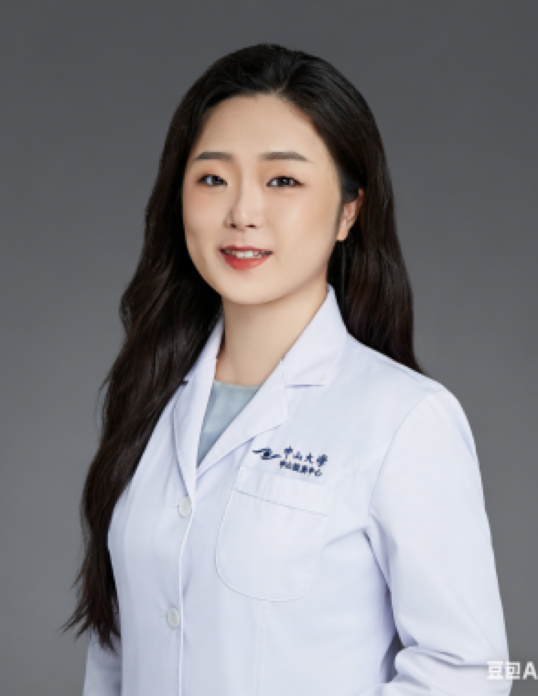

<!-- AUTO-GENERATED-BY: work/generate_obsidian_profiles.py -->

# 陈惠

## 基础信息

| 字段 | 内容 |
|---|---|
| 医院 | 中山大学中山眼科中心 |
| 姓名 | 陈惠 |
| 科室 | 小儿眼病与眼遗传病科 |
| 职称/身份 | 主治医师 |
| 重点优先级 | 中 |
| 来源类型 | 医院官网 |
| 来源链接 | [官网原文](http://www.gzzoc.org.cn/node/12014) |
| 采集日期 | 2026-08-09 |
| 复核状态 | 待人工复核 |
| 异常提示 |  |

## 简介/擅长

擅长多种成人白内障及小儿白内障疾病

## 详情正文摘录

小儿眼病与眼遗传病科 专科医师 医学博士，毕业于中山大学中山眼科中心，毕业至今工作于小儿眼病与眼遗传病科，主要从事与白内障相关的医教研工作，擅长多种成人白内障及小儿白内障疾病，致力于小儿白内障诊疗的总结与创新。获得国家级基金项目1项，市级及院级基金项目2项。近5年以第一作者身份发表论著7篇，单篇被引用最高次数100次。

## 重点关注范围

## 重点疾病标签

## 亮眼经历线索

- 近5年以第一作者身份发表论著7篇，单篇被引用最高次数100次。

## 异常提示

## 合规边界

- 本画像仅整理统一总底表中的医院官网公开字段。
- 不包含患者评价、排名、第三方来源内容或疗效承诺。
- 官网未展示的信息保持空白，后续如需补充须回到底表官方来源字段。
