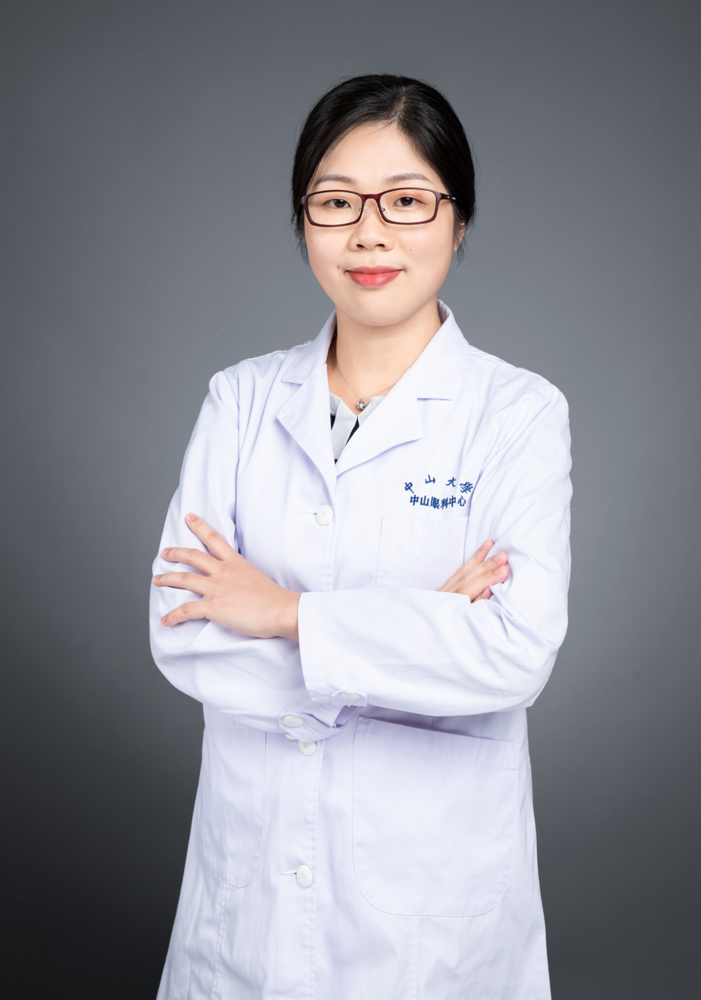

<!-- AUTO-GENERATED-BY: work/generate_obsidian_profiles.py -->

# 陈晓云

## 基础信息

| 字段 | 内容 |
|---|---|
| 医院 | 中山大学中山眼科中心 |
| 姓名 | 陈晓云 |
| 科室 | 白内障 |
| 职称/身份 | 副主任医师 |
| 重点优先级 | 中 |
| 来源类型 | 医院官网 |
| 来源链接 | [官网原文](http://www.gzzoc.org.cn/node/3278) |
| 采集日期 | 2026-08-09 |
| 复核状态 | 待人工复核 |
| 异常提示 |  |

## 简介/擅长

擅长白内障超声乳化摘除术和成人白内障的诊疗。

## 详情正文摘录

眼科学博士，瑞典卡罗琳斯卡医学院-中山大学联合培养博士，副主任医师，硕士生导师。对老年性白内障、并发性白内障的诊治有较多的经验，以第一和通讯作者在SCI期刊发表论文二十多篇，参与编写专著2部，主持国家自然科学基金1项，广州市科技计划-珠江科技新星项目获得者，广东省自然科学基金3项。

## 重点关注范围

## 重点疾病标签

## 亮眼经历线索

- 副主任医师 副主任医师 眼科学博士，瑞典卡罗琳斯卡医学院-中山大学联合培养博士，副主任医师，硕士生导师。
- 对老年性白内障、并发性白内障的诊治有较多的经验，以第一和通讯作者在SCI期刊发表论文二十多篇，参与编写专著2部，主持国家自然科学基金1项，广州市科技计划-珠江科技新星项目获得者，广东省自然科学基金3项。

## 异常提示

## 合规边界

- 本画像仅整理统一总底表中的医院官网公开字段。
- 不包含患者评价、排名、第三方来源内容或疗效承诺。
- 官网未展示的信息保持空白，后续如需补充须回到底表官方来源字段。
