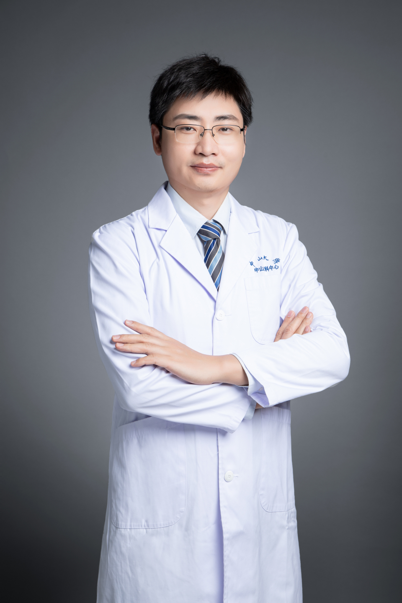

<!-- AUTO-GENERATED-BY: work/generate_obsidian_profiles.py -->

# 靳光明

## 基础信息

| 字段 | 内容 |
|---|---|
| 医院 | 中山大学中山眼科中心 |
| 姓名 | 靳光明 |
| 科室 | 白内障 |
| 职称/身份 | 副主任医师 |
| 重点优先级 | 高 |
| 来源类型 | 医院官网 |
| 来源链接 | [官网原文](http://www.gzzoc.org.cn/node/3292) |
| 采集日期 | 2026-08-09 |
| 复核状态 | 待人工复核 |
| 异常提示 |  |

## 简介/擅长

熟练掌握以白内障和以晶状体脱位为代表的常见和疑难晶状体病的诊疗和手术操作。

## 详情正文摘录

医学博士，副主任医师，从事临床工作十余年，熟练掌握以 白内障和以晶状体脱位为代表的 常见和 疑难晶状体病 的诊疗和 手术 操作 , 连续 2 年被 著名 的 欧洲 Expertscape机构评为“全球晶状体脱位专家榜” 前 5名 。 2 次受邀 参加美国 视觉与 眼科大会 (ARVO), 并 获 Travel Grant奖助， 连续 5年在中华医学会全国眼科年 会发言 分享临床 心得 和经验 。 主持国自然、省自然等基金 6 项，获专利授权 6 项，担任 10余本SCI期刊的编委/客座编委或特邀审稿人，发表 论文 1 00 余篇，其中 第一作者 /通讯作者 S CI论文 近 60 篇，多次 荣获 中山眼科中心 年度总结表彰 。

## 重点关注范围

- 疑难重症

## 重点疾病标签

- 疑难

## 亮眼经历线索

- 副主任医师 熟练掌握以白内障和以晶状体脱位为代表的常见和疑难晶状体病的诊疗和手术操作。

## 异常提示

## 合规边界

- 本画像仅整理统一总底表中的医院官网公开字段。
- 不包含患者评价、排名、第三方来源内容或疗效承诺。
- 官网未展示的信息保持空白，后续如需补充须回到底表官方来源字段。
