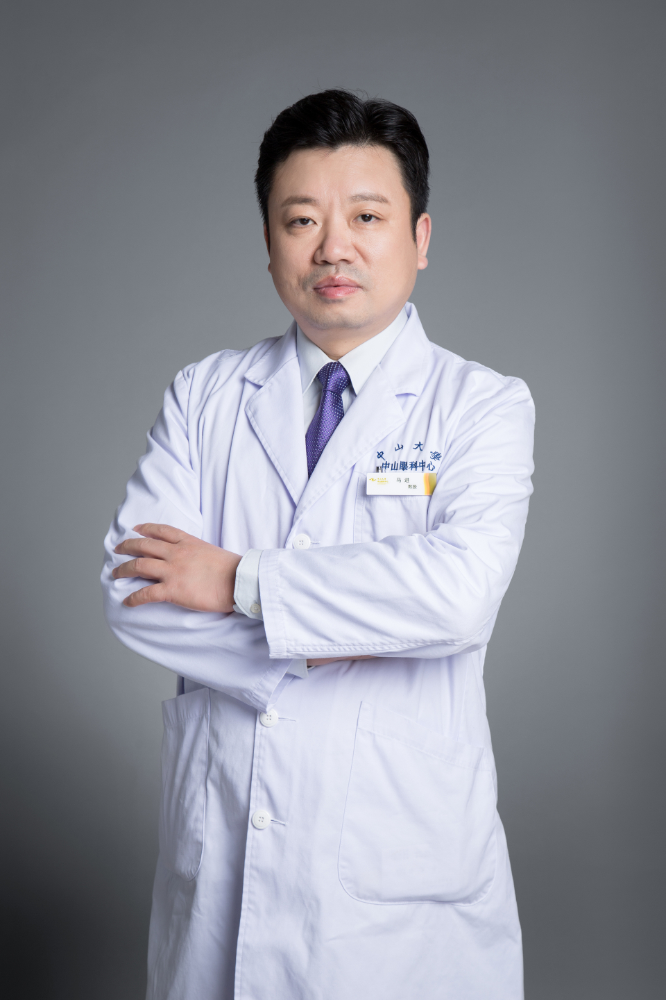

<!-- AUTO-GENERATED-BY: work/generate_obsidian_profiles.py -->

# 马进

## 基础信息

| 字段 | 内容 |
|---|---|
| 医院 | 中山大学中山眼科中心 |
| 姓名 | 马进 |
| 科室 | 玻璃体、视网膜视神经疾病 |
| 职称/身份 | 教授 |
| 重点优先级 | 中 |
| 来源类型 | 医院官网 |
| 来源链接 | [官网原文](http://www.gzzoc.org.cn/node/3176) |
| 采集日期 | 2026-08-09 |
| 复核状态 | 待人工复核 |
| 异常提示 |  |

## 简介/擅长

眼底病诊治

## 详情正文摘录

教授，主任医师，医学博士，博士生导。 眼底病科（区庄院区）主任。国家药监局药品注册审评专家咨询委员会委员、中华医学会眼科分会眼底病学组委员、中国眼超声医学工程学会委员、中国医药教育协会眼科分会常委；《Clin and Exp Ophtalmol》、Clinical Ophthalmology》、《Journal of Ophthalmology and Ophthalmic Surgery》、《中华眼底病杂志》等杂志编委。《Ophthalmology》、《IOVS》、《JAMA Ophthalmol》、《Am J Ophthalmol》、《Molacular Vision》、《Chinese Journal of Medcine》、《International Journal of Ophthalmology》杂志审稿人。主持国家自然科学基金2项、卫生部科技项目基金、广东省自然科学基金、广州市科技项目等多项基金。

## 重点关注范围

## 重点疾病标签

## 亮眼经历线索

- 教授，主任医师，医学博士，博士生导。
- 国家药监局药品注册审评专家咨询委员会委员、中华医学会眼科分会眼底病学组委员、中国眼超声医学工程学会委员、中国医药教育协会眼科分会常委；
- 主持国家自然科学基金2项、卫生部科技项目基金、广东省自然科学基金、广州市科技项目等多项基金。

## 异常提示

## 合规边界

- 本画像仅整理统一总底表中的医院官网公开字段。
- 不包含患者评价、排名、第三方来源内容或疗效承诺。
- 官网未展示的信息保持空白，后续如需补充须回到底表官方来源字段。
