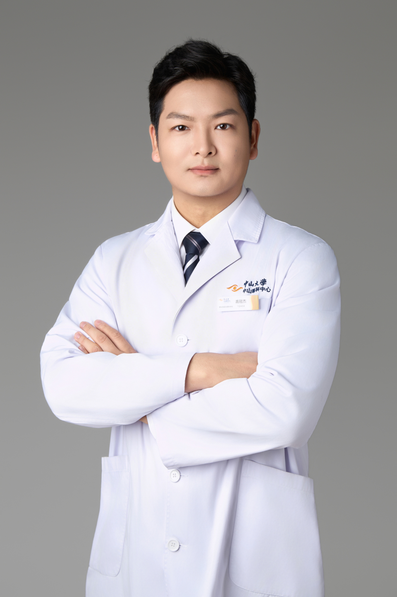

<!-- AUTO-GENERATED-BY: work/generate_obsidian_profiles.py -->

# 高冠杰

## 基础信息

| 字段 | 内容 |
|---|---|
| 医院 | 中山大学中山眼科中心 |
| 姓名 | 高冠杰 |
| 科室 | 眼科急症、眼外伤 |
| 职称/身份 | 医师 |
| 重点优先级 | 普通 |
| 来源类型 | 医院官网 |
| 来源链接 | [官网原文](http://www.gzzoc.org.cn/node/14223) |
| 采集日期 | 2026-08-09 |
| 复核状态 | 待人工复核 |
| 异常提示 |  |

## 简介/擅长

各类眼科急症与眼外伤应急处理，专注于外伤性眼眶骨折整复、视网膜脱离复位及鼻内镜技术的深入学习和掌握。

## 详情正文摘录

眼科学博士，博士后。熟练掌握各类眼科急症与眼外伤应急处理，专注于外伤性眼眶骨折整复、视网膜脱离复位及鼻内镜技术的深入学习和掌握。主要研究方向为干细胞与视网膜疾病防治，包括视网膜疾病模型构建及干细胞替代治疗研发，共发表SCI论文近10篇，主持中国博士后科学基金1项及广东省区域联合基金1项，授权发明专利1项。

## 重点关注范围

## 重点疾病标签

## 亮眼经历线索

- 主要研究方向为干细胞与视网膜疾病防治，包括视网膜疾病模型构建及干细胞替代治疗研发，共发表SCI论文近10篇，主持中国博士后科学基金1项及广东省区域联合基金1项，授权发明专利1项。

## 异常提示

## 合规边界

- 本画像仅整理统一总底表中的医院官网公开字段。
- 不包含患者评价、排名、第三方来源内容或疗效承诺。
- 官网未展示的信息保持空白，后续如需补充须回到底表官方来源字段。
