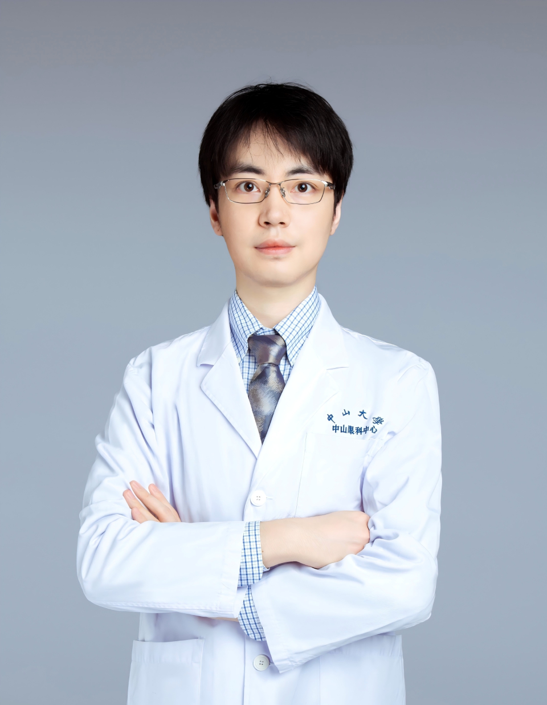

<!-- AUTO-GENERATED-BY: work/generate_obsidian_profiles.py -->

# 高凯

## 基础信息

| 字段 | 内容 |
|---|---|
| 医院 | 中山大学中山眼科中心 |
| 姓名 | 高凯 |
| 科室 | 青光眼 |
| 职称/身份 | 副主任医师 |
| 重点优先级 | 中 |
| 来源类型 | 医院官网 |
| 来源链接 | [官网原文](http://www.gzzoc.org.cn/node/3226) |
| 采集日期 | 2026-08-09 |
| 复核状态 | 待人工复核 |
| 异常提示 |  |

## 简介/擅长

擅长多种类型青光眼，如原发性青光眼、继发性青光眼等疾病的诊治

## 详情正文摘录

医学博士，副主任医师。主要从事青光眼相关的医教研工作，曾赴美国华盛顿大学交流学习。主持广东省自然科学基金等多项科研项目，并以第一作者身份在国际权威眼科学术期刊发表多篇SCI论文。

## 重点关注范围

## 重点疾病标签

## 亮眼经历线索

- 副主任医师 副主任医师 医学博士，副主任医师。
- 主要从事青光眼相关的医教研工作，曾赴美国华盛顿大学交流学习。

## 异常提示

## 合规边界

- 本画像仅整理统一总底表中的医院官网公开字段。
- 不包含患者评价、排名、第三方来源内容或疗效承诺。
- 官网未展示的信息保持空白，后续如需补充须回到底表官方来源字段。
