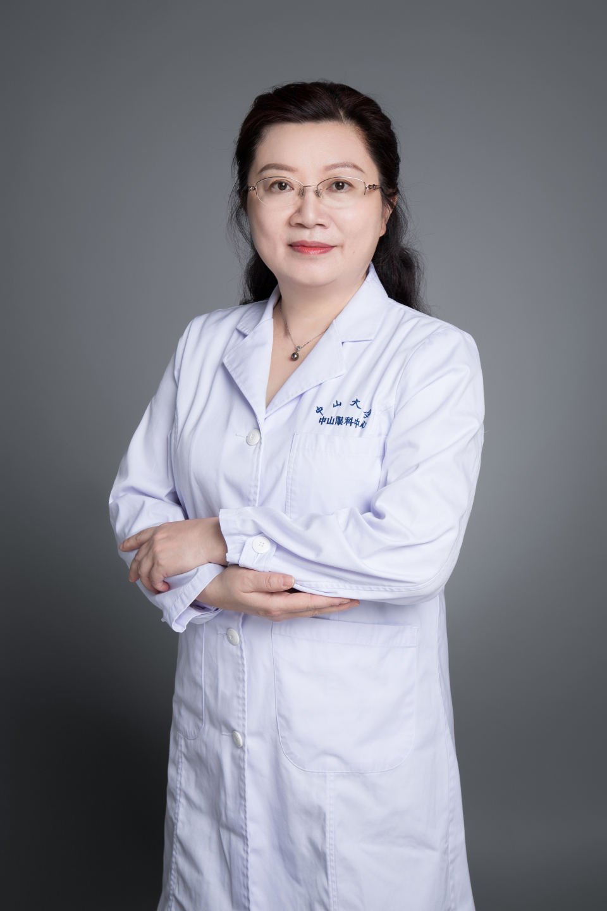

<!-- AUTO-GENERATED-BY: work/generate_obsidian_profiles.py -->

# 黄丹平

## 基础信息

| 字段 | 内容 |
|---|---|
| 医院 | 中山大学中山眼科中心 |
| 姓名 | 黄丹平 |
| 科室 | 眼整形与泪器病 |
| 职称/身份 | 教授 |
| 重点优先级 | 高 |
| 来源类型 | 医院官网 |
| 来源链接 | [官网原文](http://www.gzzoc.org.cn/node/3098) |
| 采集日期 | 2026-08-09 |
| 复核状态 | 待人工复核 |
| 异常提示 |  |

## 简介/擅长

擅长各种眼部整形美容手术，对上睑下垂矫正术、小睑裂综合征矫正术，活动性义眼座植入术，双重睑成形术，眼袋整复术，以及泪道激光成形联合义管植入术和激光美容术，均有丰富的临床经验。

## 详情正文摘录

教授，主任医师，医学博士，博士研究生导师。广东省医学会整形外科学分会委员，广东省医学会激光医学分会委员，从事眼科医疗、教学、科研工作26年，是国内最早开展眼整形手术的专家之一。 在眼球摘除术后义眼座植入方面有较深的造诣，在国内率先开展该领域的临床和基础研究，采用改良眼内容剜除联合义眼座植入术，大大减少了义眼座暴露的发生率，手术方法在国内推广应用，研究成果获广东省科学技术三等奖，临床研究论文发表在美国权威临床杂志上。在国内率先开展额肌瓣悬吊治疗先天性上睑下垂，取得较好的手术效果；率先开展结膜囊成形生物材料的实验和临床研究，开发新材料应用于结膜重建并在国内推广应用。 主要科研业绩及奖项：以第一主持人承担多项课题研究，其中国家自然科学基金1项，广东省自然科学基金2项，广东省科技计划项目4项，广东省卫生厅基金1项；在国外及国内国家级杂志发表学术论文25篇，其中第一作者及通讯作者论文20篇，第一作者SCI论文4篇，其中关于义眼座植入的临床研究论文得到国际眼科学术界的认可，以第一作者和通讯作者发表在美国权威临床杂志《American Journal of Ophthalmology》上。以第一完成者获得广东省科技进步三等奖1项；目前是国外多家眼科杂志的审稿专家。参与《眼科手术学》、《眼整形外科学》，全国卫生专业技术资格考试习题集丛书》，《眼科学基础与临床》等眼科专著的编写工作，担任编委。 已培养硕士研究生12名，其中8名已毕业。

## 重点关注范围

- 术后恢复/康复

## 重点疾病标签

- 术后

## 亮眼经历线索

- 教授，主任医师，医学博士，博士研究生导师。
- 广东省医学会整形外科学分会委员，广东省医学会激光医学分会委员，从事眼科医疗、教学、科研工作26年，是国内最早开展眼整形手术的专家之一。
- 在眼球摘除术后义眼座植入方面有较深的造诣，在国内率先开展该领域的临床和基础研究，采用改良眼内容剜除联合义眼座植入术，大大减少了义眼座暴露的发生率，手术方法在国内推广应用，研究成果获广东省科学技术三等奖，临床研究论文发表在美国权威临床杂志上。
- 在国内率先开展额肌瓣悬吊治疗先天性上睑下垂，取得较好的手术效果；

## 异常提示

## 合规边界

- 本画像仅整理统一总底表中的医院官网公开字段。
- 不包含患者评价、排名、第三方来源内容或疗效承诺。
- 官网未展示的信息保持空白，后续如需补充须回到底表官方来源字段。
