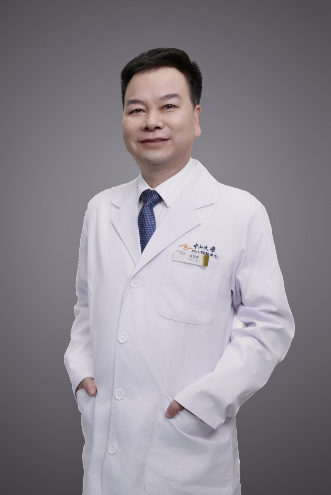

<!-- AUTO-GENERATED-BY: work/generate_obsidian_profiles.py -->

# 黄国富

## 基础信息

| 字段 | 内容 |
|---|---|
| 医院 | 中山大学中山眼科中心 |
| 姓名 | 黄国富 |
| 科室 | 近视眼激光治疗科 |
| 职称/身份 | 教授 |
| 重点优先级 | 高 |
| 来源类型 | 医院官网 |
| 来源链接 | [官网原文](http://www.gzzoc.org.cn/node/12082) |
| 采集日期 | 2026-08-09 |
| 复核状态 | 待人工复核 |
| 异常提示 |  |

## 简介/擅长

擅长近视、远视、散光及老视的手术治疗，包括全飞秒激光术、半飞秒激光术、准分子激光术、全激光术、有晶体眼人工晶体植入术（ICL）等；擅长复杂疑难屈光手术。

## 详情正文摘录

眼科学博士，美国加州大学三藩分校博士后，教授，主任医师，博士/硕士研究生导师，近视眼激光治疗科主任，中山大学“临床百人”计划引进人才，国务院政府特津贴专家，省级“双千计划”人才，省级“百千万”工程人才，省级主要学科学术带头人，省级卫健委有突出贡献中青年专家。现任中山大学中山眼科中心近视激光治疗中心主任兼学科带头人。中华医学会眼科学分会青年委员会委员、中华医学会眼科学分会防盲及眼流行病学组委员兼秘书、中国医师协会眼显微外科学组科委员、中华激光医学会青年委员会委员、中华屈光手术俱乐部专家成员。国家自然科学基金评审专家，美国AAO/ARVO会员，JCRS、JRS、IOVS等国际杂志审稿专家。中山大学中山眼科中心屈光手术首位专业博士，国内最早一批从事屈光手术的医师，擅长近视、远视、散光及老视的手术矫治，对屈光手术并发症的处理经验丰富，擅长圆锥角膜的诊断和治疗。主持国家自然科学基金3项，省级自然科学基金重点项目1项，省部级自然科学基金5项，省级重点人才项目2项。发表高水平研究论文50余篇，中文核心期刊10余篇。获中华医学会优秀论文一等奖；省科技进步二等奖（第一完成人）；获批发明专利3项。已培养博士及硕士20余名。

## 重点关注范围

- 疑难重症

## 重点疾病标签

- 疑难
- 复杂

## 亮眼经历线索

- 擅长复杂疑难屈光手术。
- 眼科学博士，美国加州大学三藩分校博士后，教授，主任医师，博士/硕士研究生导师，近视眼激光治疗科主任，中山大学“临床百人”计划引进人才，国务院政府特津贴专家，省级“双千计划”人才，省级“百千万”工程人才，省级主要学科学术带头人，省级卫健委有突出贡献中青年专家。
- 现任中山大学中山眼科中心近视激光治疗中心主任兼学科带头人。

## 异常提示

## 合规边界

- 本画像仅整理统一总底表中的医院官网公开字段。
- 不包含患者评价、排名、第三方来源内容或疗效承诺。
- 官网未展示的信息保持空白，后续如需补充须回到底表官方来源字段。
