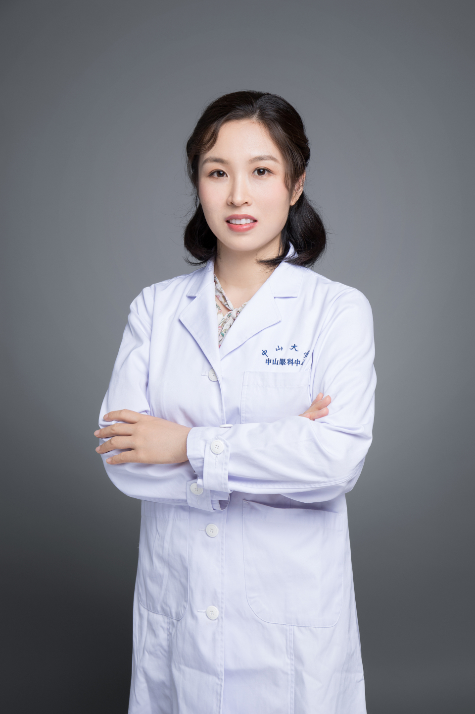

<!-- AUTO-GENERATED-BY: work/generate_obsidian_profiles.py -->

# 黄莉

## 基础信息

| 字段 | 内容 |
|---|---|
| 医院 | 中山大学中山眼科中心 |
| 姓名 | 黄莉 |
| 科室 | 小儿眼病与眼遗传病科 |
| 职称/身份 | 副主任医师 |
| 重点优先级 | 中 |
| 来源类型 | 医院官网 |
| 来源链接 | [官网原文](http://www.gzzoc.org.cn/node/3293) |
| 采集日期 | 2026-08-09 |
| 复核状态 | 待人工复核 |
| 异常提示 |  |

## 简介/擅长

常见眼底疾病的诊治，尤其擅长儿童眼底病和眼遗传病的诊断和治疗。

## 详情正文摘录

博士，副主任医师，硕士研究生导师。从事眼科临床、科研、教学10余年。广东省医学会医学遗传学分会委员，广东省医学会眼科学分会儿童眼病学组秘书。以第一作者、通讯作者发表论文20余篇，主持国家及省市级基金5项。获广东省柯麟医学教育基金会临床医学专业优秀中青年教师奖。

## 重点关注范围

## 重点疾病标签

## 亮眼经历线索

- 副主任医师 副主任医师 博士，副主任医师，硕士研究生导师。
- 广东省医学会医学遗传学分会委员，广东省医学会眼科学分会儿童眼病学组秘书。

## 异常提示

## 合规边界

- 本画像仅整理统一总底表中的医院官网公开字段。
- 不包含患者评价、排名、第三方来源内容或疗效承诺。
- 官网未展示的信息保持空白，后续如需补充须回到底表官方来源字段。
