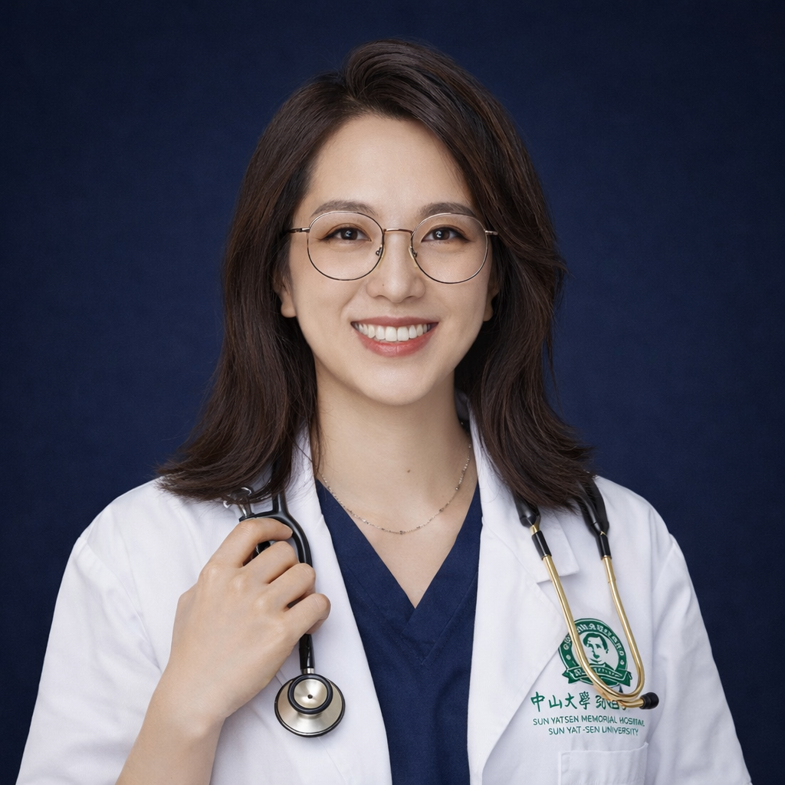

<!-- AUTO-GENERATED-BY: work/generate_obsidian_profiles.py -->

<!-- TEMPLATE: D:\workspace\信息收集整理\医生画像仓库\模板\医生画像模板.md -->

# 于水莲

## 基础信息

| 字段 | 内容 |
|---|---|
| 姓名 | 于水莲 |
| 医院 | 中山大学孙逸仙纪念医院 |
| 科室 | 风湿免疫科 |
| 职称/身份 | 主任医师 |
| 来源链接 | [官网原文](https://www.gzsys.org.cn/doctor/34141) |
| 采集日期 | 2026-08-13 |

## 简介/擅长

①前沿：系统性红斑狼疮、狼疮肾炎、非典型溶血性尿毒症综合征（aHUS）、类风湿关节炎、痛风性关节炎、强直性脊柱炎、银屑病关节炎、干燥综合征、血管炎、硬皮病等生物制剂或小分子靶向药治疗；

## 教育与进修经历

- 主任医师，硕士生导师，博士毕业于香港中文大学，哈佛大学博士后，哈佛大学附属BIDMC医院风湿免疫中心研究员，现任中国医师协会青委，广东省医院协会、省药学会、省保健协会、省医疗行业协会、省社区卫生协会副主委（风湿病学分会）。

## 科研项目与成果

- 科研方向聚焦狼疮肾炎足细胞损伤机制及靶向治疗，开展外泌体/纳米靶向递送及AI肾脏病理预测模型研究。
- 在A&R、JCI Insight、Phytomedicine等国际期刊发表SCI论文23篇，主持国家自然科学基金、教育部博士点、省自然、省科技及香港风湿病年度研究基金等12项。

## 论文与学术产出

- 在A&R、JCI Insight、Phytomedicine等国际期刊发表SCI论文23篇，主持国家自然科学基金、教育部博士点、省自然、省科技及香港风湿病年度研究基金等12项。

## 可包装亮点

- 主任医师，硕士生导师，博士毕业于香港中文大学，哈佛大学博士后，哈佛大学附属BIDMC医院风湿免疫中心研究员，现任中国医师协会青委，广东省医院协会、省药学会、省保健协会、省医疗行业协会、省社区卫生协会副主委（风湿病学分会）。
- 曾获广州市高层次人才、市卫健委优秀人才称号，并获得欧洲EULAR, 亚太APLAR,日本JCR青年研究者奖。
- 在A&R、JCI Insight、Phytomedicine等国际期刊发表SCI论文23篇，主持国家自然科学基金、教育部博士点、省自然、省科技及香港风湿病年度研究基金等12项。
- ②疑难重症：TMA、TTP、白塞病、皮肌炎、肌炎、结缔组织病相关间质性肺炎、SAPHO、罗道病诊治；

## 重点疾病/人群标签

- 慢性病：
- 肿瘤：靶向、风湿、免疫、红斑狼疮、类风湿、强直性脊柱炎、疑难、重症
- 生殖疾病：
- 免疫/风湿：靶向、风湿、免疫、红斑狼疮、类风湿、强直性脊柱炎、疑难、重症
- 术后恢复/康复：
- 疑难重症：靶向、风湿、免疫、红斑狼疮、类风湿、强直性脊柱炎、疑难、重症

## 证据摘录

> 只摘录官网公开信息中的短句或关键字段，不复制大段原文。

- 官网身份字段：主任医师
- 官网简介/擅长：①前沿：系统性红斑狼疮、狼疮肾炎、非典型溶血性尿毒症综合征（aHUS）、类风湿关节炎、痛风性关节炎、强直性脊柱炎、银屑病关节炎、干燥综合征、血管炎、硬皮病等生物制剂或小分子靶向药治疗；
- 官网亮眼经历线索：主任医师，硕士生导师，博士毕业于香港中文大学，哈佛大学博士后，哈佛大学附属BIDMC医院风湿免疫中心研究员，现任中国医师协会青委，广东省医院协会、省药学会、省保健协会、省医疗行业协会、省社区卫生协会副主委（风湿病学分会）。 曾获广州市高层次人才、市卫健委优秀人才称号，并获得欧洲EULAR, 亚太APLAR,日本JCR青年研究者奖。 在A&R、JCI Insight、Phytomedicine等国际期刊发表SCI论文23篇，主持国家自然…
- 来源链接：https://www.gzsys.org.cn/doctor/34141

## BD 画像摘要

于水莲医生可作为肿瘤、免疫/风湿/感染、疑难重症方向的基础画像候选。后续 BD 使用应继续以官网来源和人工复核为准，不添加疗效承诺或无来源包装。

## 合规边界

- 仅使用医院官网、官方公众号、官方小程序等公开渠道。
- 不采集私人电话、私人微信、家庭住址、患者隐私或非公开排班信息。
- 不写“保证治愈”“疗效第一”“包治疑难杂症”等无法由官网证明的表述。
