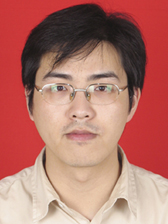

<!-- AUTO-GENERATED-BY: work/generate_obsidian_profiles.py -->

<!-- TEMPLATE: D:\workspace\信息收集整理\医生画像仓库\模板\医生画像模板.md -->

# 于涛

## 基础信息

| 字段 | 内容 |
|---|---|
| 姓名 | 于涛 |
| 医院 | 中山大学孙逸仙纪念医院 |
| 科室 | 消化内科 |
| 职称/身份 | 主任医师 |
| 来源链接 | [官网原文](https://www.gzsys.org.cn/doctor/14809) |
| 采集日期 | 2026-08-13 |

## 简介/擅长

## 教育与进修经历

- 美国马里兰大学医学院VA Health Center胃肠病研究所访问学者。

## 科研项目与成果

- 先后主持国家自然科学基金2项，厅局级课题2项，校级课题2项，横向课题1项，参与国家级科研课题3项、省级课题2项。
- 拥有国家发明专利2项。

## 论文与学术产出

- 先后在Cell Death Dis、Stem Cell Res Ther、Cell Prolif、Stem Cell Dev、Dev Growth Differ、J Diabetes Complicat、BMC Cell Biol、Dig Dis Sci、Mol Cell Biochem等SCI收录杂志发表第一/通讯作者论著40余篇。

## 可包装亮点

- 现任中华医学会消化病分会青年委员、中华医学会消化病分会食管疾病协作组委员、广东省医学会消化内镜分会委员兼秘书、广东省医学会胰腺病学组委员兼秘书、广东省杰出青年医学人才、广东省医疗行业协会消化内镜分会主任委员及消化病分会副主任委员。
- 美国马里兰大学医学院VA Health Center胃肠病研究所访问学者。
- 先后在Cell Death Dis、Stem Cell Res Ther、Cell Prolif、Stem Cell Dev、Dev Growth Differ、J Diabetes Complicat、BMC Cell Biol、Dig Dis Sci、Mol Cell Biochem等SCI收录杂志发表第一/通讯作者论著40余篇。
- 先后主持国家自然科学基金2项，厅局级课题2项，校级课题2项，横向课题1项，参与国家级科研课题3项、省级课题2项。

## 重点疾病/人群标签

- 慢性病：糖尿病、癌
- 肿瘤：糖尿病、癌
- 生殖疾病：
- 免疫/风湿：
- 术后恢复/康复：
- 疑难重症：

## 证据摘录

> 只摘录官网公开信息中的短句或关键字段，不复制大段原文。

- 官网身份字段：主任医师
- 官网亮眼经历线索：现任中华医学会消化病分会青年委员、中华医学会消化病分会食管疾病协作组委员、广东省医学会消化内镜分会委员兼秘书、广东省医学会胰腺病学组委员兼秘书、广东省杰出青年医学人才、广东省医疗行业协会消化内镜分会主任委员及消化病分会副主任委员。 美国马里兰大学医学院VA Health Center胃肠病研究所访问学者。 先后在Cell Death Dis、Stem Cell Res Ther、Cell Prolif、Stem Cell Dev、De…
- 来源链接：https://www.gzsys.org.cn/doctor/14809

## BD 画像摘要

于涛医生可作为慢性病、肿瘤方向的基础画像候选。后续 BD 使用应继续以官网来源和人工复核为准，不添加疗效承诺或无来源包装。

## 合规边界

- 仅使用医院官网、官方公众号、官方小程序等公开渠道。
- 不采集私人电话、私人微信、家庭住址、患者隐私或非公开排班信息。
- 不写“保证治愈”“疗效第一”“包治疑难杂症”等无法由官网证明的表述。
