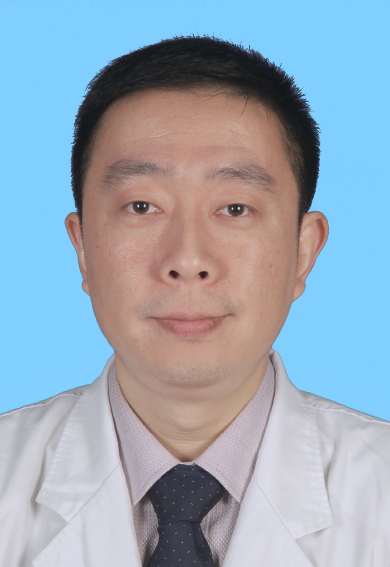

<!-- AUTO-GENERATED-BY: work/generate_obsidian_profiles.py -->

<!-- TEMPLATE: D:\workspace\信息收集整理\医生画像仓库\模板\医生画像模板.md -->

# 于钟

## 基础信息

| 字段 | 内容 |
|---|---|
| 姓名 | 于钟 |
| 医院 | 中山大学孙逸仙纪念医院 |
| 科室 | 消化内科 |
| 职称/身份 | 副主任医师 |
| 来源链接 | [官网原文](https://www.gzsys.org.cn/doctor/14810) |
| 采集日期 | 2026-08-13 |

## 简介/擅长

## 教育与进修经历

- 1994年毕业于中山医科大学临床医学专业，从事消化内科临床医学、教学、科研20多年。

## 科研项目与成果

- 1994年毕业于中山医科大学临床医学专业，从事消化内科临床医学、教学、科研20多年。

## 可包装亮点

- 于钟，中山大学孙逸仙纪念医院消化内科，副主任医师，博士，硕士生导师。
- 广东省肝脏病学会胶囊内镜专业委员会常务委员，广东省医学会消化病学分会动力学组委员，广东省健康管理学会脂肪肝多学科诊治专业委员会委员，广东省医学会肝病学分会酒精肝学组委员。

## 重点疾病/人群标签

- 慢性病：
- 肿瘤：
- 生殖疾病：
- 免疫/风湿：
- 术后恢复/康复：
- 疑难重症：多学科

## 证据摘录

> 只摘录官网公开信息中的短句或关键字段，不复制大段原文。

- 官网身份字段：副主任医师
- 官网亮眼经历线索：于钟，中山大学孙逸仙纪念医院消化内科，副主任医师，博士，硕士生导师。 广东省肝脏病学会胶囊内镜专业委员会常务委员，广东省医学会消化病学分会动力学组委员，广东省健康管理学会脂肪肝多学科诊治专业委员会委员，广东省医学会肝病学分会酒精肝学组委员。
- 来源链接：https://www.gzsys.org.cn/doctor/14810

## BD 画像摘要

于钟医生可作为疑难重症方向的基础画像候选。后续 BD 使用应继续以官网来源和人工复核为准，不添加疗效承诺或无来源包装。

## 合规边界

- 仅使用医院官网、官方公众号、官方小程序等公开渠道。
- 不采集私人电话、私人微信、家庭住址、患者隐私或非公开排班信息。
- 不写“保证治愈”“疗效第一”“包治疑难杂症”等无法由官网证明的表述。
