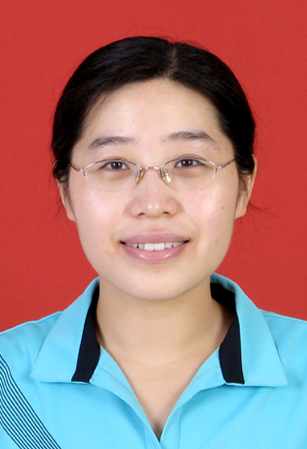

<!-- AUTO-GENERATED-BY: work/generate_obsidian_profiles.py -->

<!-- TEMPLATE: D:\workspace\信息收集整理\医生画像仓库\模板\医生画像模板.md -->

# 任萌

## 基础信息

| 字段 | 内容 |
|---|---|
| 姓名 | 任萌 |
| 医院 | 中山大学孙逸仙纪念医院 |
| 科室 | 内分泌内科 |
| 职称/身份 | 教授, 主任医师, 副研究员 |
| 来源链接 | [官网原文](https://www.gzsys.org.cn/node/15328) |
| 采集日期 | 2026-08-13 |

## 简介/擅长

糖尿病 甲状腺疾病

## 教育与进修经历

- 内科副主任、内分泌内科教授、主任医师、副研究员、硕士生导师，医学博士，博士后，现任内分泌内科实验室副主任。
- 2007年博士研究生毕业， 2009年博士后出站。

## 科研项目与成果

- 内科副主任、内分泌内科教授、主任医师、副研究员、硕士生导师，医学博士，博士后，现任内分泌内科实验室副主任。
- 负责包括国家自然科学基金在内的六项科研基金，参与多项国家及省部级科研课题 以第一作者发表 SCI收录多篇。

## 论文与学术产出

- 负责包括国家自然科学基金在内的六项科研基金，参与多项国家及省部级科研课题 以第一作者发表 SCI收录多篇。
- 2008年获得第10届亚洲分子糖尿病研讨会优秀论文奖。

## 可包装亮点

- 内科副主任、内分泌内科教授、主任医师、副研究员、硕士生导师，医学博士，博士后，现任内分泌内科实验室副主任。
- 负责包括国家自然科学基金在内的六项科研基金，参与多项国家及省部级科研课题 以第一作者发表 SCI收录多篇。
- 2008年获得第10届亚洲分子糖尿病研讨会优秀论文奖。
- 2010年获得广东省青年医师糖尿病论坛演讲比赛一等奖。

## 重点疾病/人群标签

- 慢性病：糖尿病
- 肿瘤：
- 生殖疾病：
- 免疫/风湿：
- 术后恢复/康复：
- 疑难重症：

## 证据摘录

> 只摘录官网公开信息中的短句或关键字段，不复制大段原文。

- 官网身份字段：教授, 主任医师, 副研究员
- 官网简介/擅长：糖尿病 甲状腺疾病
- 官网亮眼经历线索：内科副主任、内分泌内科教授、主任医师、副研究员、硕士生导师，医学博士，博士后，现任内分泌内科实验室副主任。 负责包括国家自然科学基金在内的六项科研基金，参与多项国家及省部级科研课题 以第一作者发表 SCI收录多篇。 2008年获得第10届亚洲分子糖尿病研讨会优秀论文奖。 2010年获得广东省青年医师糖尿病论坛演讲比赛一等奖。
- 来源链接：https://www.gzsys.org.cn/node/15328

## BD 画像摘要

任萌医生可作为慢性病方向的基础画像候选。后续 BD 使用应继续以官网来源和人工复核为准，不添加疗效承诺或无来源包装。

## 合规边界

- 仅使用医院官网、官方公众号、官方小程序等公开渠道。
- 不采集私人电话、私人微信、家庭住址、患者隐私或非公开排班信息。
- 不写“保证治愈”“疗效第一”“包治疑难杂症”等无法由官网证明的表述。
