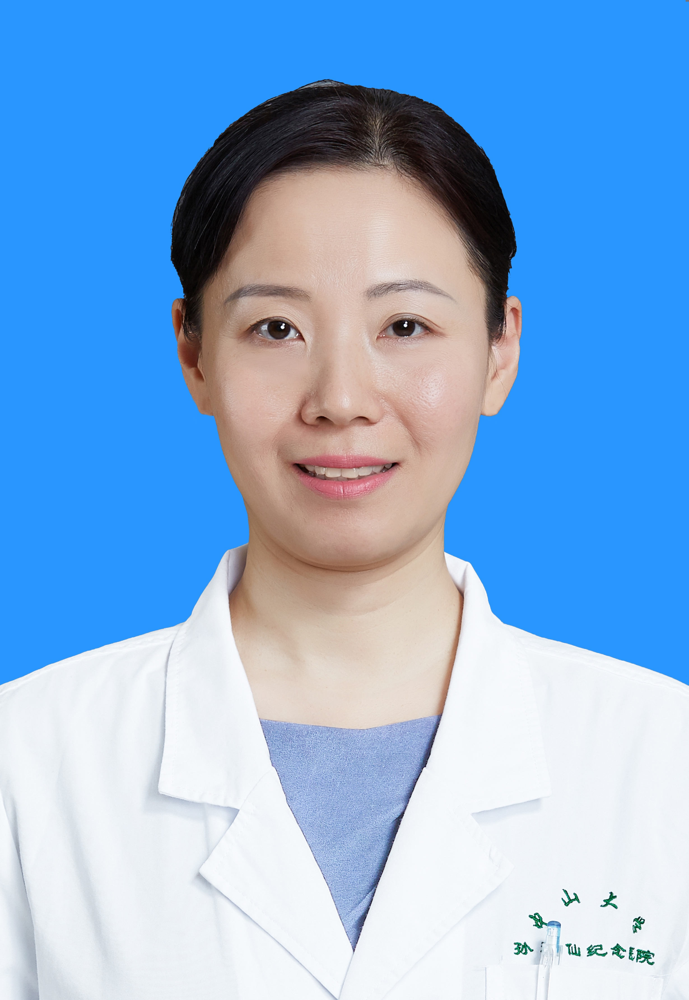

<!-- AUTO-GENERATED-BY: work/generate_obsidian_profiles.py -->

<!-- TEMPLATE: D:\workspace\信息收集整理\医生画像仓库\模板\医生画像模板.md -->

# 伍俊妍

## 基础信息

| 字段 | 内容 |
|---|---|
| 姓名 | 伍俊妍 |
| 医院 | 中山大学孙逸仙纪念医院 |
| 科室 | 药学部 |
| 职称/身份 | 主任药师 |
| 来源链接 | [官网原文](https://www.gzsys.org.cn/node/14640) |
| 采集日期 | 2026-08-13 |

## 简介/擅长

## 论文与学术产出

- 主编专著《外科药学》（中国医药科技出版社）。
- 国内核心期刊及SCI ，以第一作者及通讯作者发表论文50余篇（Lancet Diabetes Endocrinol1篇）。

## 可包装亮点

- 药学部主任、Ⅰ期临床研究中心主任 国家卫健委医院管理研究所药学信息专家委员会副主任委员、国家卫健委药事管理与药物治疗学委员会委员、中国药学会理事、广东省药学会医院药学专业委员会主任委员、广东省卫健委药品临床综合评价中心主任 于2015年创建并执笔编写了广东省药学会《超药品说明书用药目录》。
- 国内核心期刊及SCI ，以第一作者及通讯作者发表论文50余篇（Lancet Diabetes Endocrinol1篇）。

## 重点疾病/人群标签

- 慢性病：
- 肿瘤：
- 生殖疾病：
- 免疫/风湿：
- 术后恢复/康复：
- 疑难重症：

## 证据摘录

> 只摘录官网公开信息中的短句或关键字段，不复制大段原文。

- 官网身份字段：主任药师
- 官网亮眼经历线索：药学部主任、Ⅰ期临床研究中心主任 国家卫健委医院管理研究所药学信息专家委员会副主任委员、国家卫健委药事管理与药物治疗学委员会委员、中国药学会理事、广东省药学会医院药学专业委员会主任委员、广东省卫健委药品临床综合评价中心主任 于2015年创建并执笔编写了广东省药学会《超药品说明书用药目录》。 国内核心期刊及SCI ，以第一作者及通讯作者发表论文50余篇（Lancet Diabetes Endocrinol1篇）。
- 异常提示：职称/身份需人工复核
- 来源链接：https://www.gzsys.org.cn/node/14640

## BD 画像摘要

伍俊妍医生可作为中山大学孙逸仙纪念医院药学部的基础医生资料入库。当前重点方向以总底表标签为准，官网未展示的信息保持空白。

## 合规边界

- 仅使用医院官网、官方公众号、官方小程序等公开渠道。
- 不采集私人电话、私人微信、家庭住址、患者隐私或非公开排班信息。
- 不写“保证治愈”“疗效第一”“包治疑难杂症”等无法由官网证明的表述。
