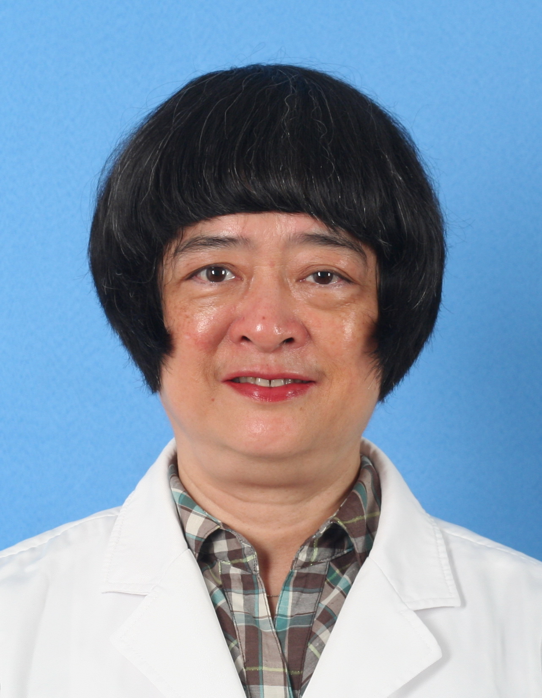

<!-- AUTO-GENERATED-BY: work/generate_obsidian_profiles.py -->

<!-- TEMPLATE: D:\workspace\信息收集整理\医生画像仓库\模板\医生画像模板.md -->

# 伍卫

## 基础信息

| 字段 | 内容 |
|---|---|
| 姓名 | 伍卫 |
| 医院 | 中山大学孙逸仙纪念医院 |
| 科室 | 心血管内科 |
| 职称/身份 | 教授, 主任医师 |
| 来源链接 | [官网原文](https://www.gzsys.org.cn/node/14817) |
| 采集日期 | 2026-08-13 |

## 简介/擅长

## 教育与进修经历

- 1982年12月原中山医科大学（中山医学院）临床医学专业本科毕业后一直在原中山医科大学附属医院内科、心血管内科从事临床医疗、教学与科研工作，临床经验丰富。

## 科研项目与成果

- 1982年12月原中山医科大学（中山医学院）临床医学专业本科毕业后一直在原中山医科大学附属医院内科、心血管内科从事临床医疗、教学与科研工作，临床经验丰富。

## 可包装亮点

- 医学博士，教授（二级）/主任医师（一级），博士生导师。
- 曾任中山大学孙逸仙纪念医院心血管内科主任、心血管医学部主任、大内科主任、内科学教研室主任、诊断学教研室主任，中山大学附属第五医院院长。
- 1994-1999年获心律失常/心脏起搏临床与实验研究方面的省部级科技进步三等奖3项（第2完成人）。
- 2002年获广东省高等学校“千百十工程”省级培养对象，2014年获中山大学首届名医，2014年获第九届中国医师奖。

## 重点疾病/人群标签

- 慢性病：高血压、冠心病、心力衰竭、动脉粥样硬化
- 肿瘤：
- 生殖疾病：
- 免疫/风湿：
- 术后恢复/康复：
- 疑难重症：

## 证据摘录

> 只摘录官网公开信息中的短句或关键字段，不复制大段原文。

- 官网身份字段：教授, 主任医师
- 官网亮眼经历线索：医学博士，教授（二级）/主任医师（一级），博士生导师。 曾任中山大学孙逸仙纪念医院心血管内科主任、心血管医学部主任、大内科主任、内科学教研室主任、诊断学教研室主任，中山大学附属第五医院院长。 1994-1999年获心律失常/心脏起搏临床与实验研究方面的省部级科技进步三等奖3项（第2完成人）。 2002年获广东省高等学校“千百十工程”省级培养对象，2014年获中山大学首届名医，2014年获第九届中国医师奖。
- 来源链接：https://www.gzsys.org.cn/node/14817

## BD 画像摘要

伍卫医生可作为慢性病方向的基础画像候选。后续 BD 使用应继续以官网来源和人工复核为准，不添加疗效承诺或无来源包装。

## 合规边界

- 仅使用医院官网、官方公众号、官方小程序等公开渠道。
- 不采集私人电话、私人微信、家庭住址、患者隐私或非公开排班信息。
- 不写“保证治愈”“疗效第一”“包治疑难杂症”等无法由官网证明的表述。
