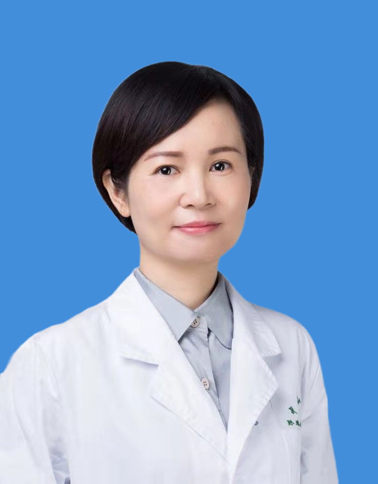

<!-- AUTO-GENERATED-BY: work/generate_obsidian_profiles.py -->

<!-- TEMPLATE: D:\workspace\信息收集整理\医生画像仓库\模板\医生画像模板.md -->

# 伍少玲

## 基础信息

| 字段 | 内容 |
|---|---|
| 姓名 | 伍少玲 |
| 医院 | 中山大学孙逸仙纪念医院 |
| 科室 | 康复医学科 |
| 职称/身份 | 主任医师 |
| 来源链接 | [官网原文](https://www.gzsys.org.cn/node/15270) |
| 采集日期 | 2026-08-13 |

## 简介/擅长

## 科研项目与成果

- 科研方面：主持国家自然科学基金2项,省级科研基金4项。

## 论文与学术产出

- 以第一作者或通讯作者发表SCI文章30篇。
- 主编专著2本，副主编2本。

## 可包装亮点

- 社会任职：中华医学会高压氧分会委员、中国康复医学会运动康复分会常委、广东省医学会高压氧分会副主任委员、广东省医学会物理医学与康复分会常委/疼痛康复学组组长、广东省康复医学会疼痛康复分会副会长/超声介入康复分会副会长、广东省康复医学会脊柱康复分会常务理事等。
- 科研方面：主持国家自然科学基金2项,省级科研基金4项。
- 以第一作者或通讯作者发表SCI文章30篇。

## 重点疾病/人群标签

- 慢性病：慢性、康复、疼痛、重症
- 肿瘤：
- 生殖疾病：
- 免疫/风湿：
- 术后恢复/康复：慢性、康复、疼痛、重症
- 疑难重症：慢性、康复、疼痛、重症

## 证据摘录

> 只摘录官网公开信息中的短句或关键字段，不复制大段原文。

- 官网身份字段：主任医师
- 官网亮眼经历线索：社会任职：中华医学会高压氧分会委员、中国康复医学会运动康复分会常委、广东省医学会高压氧分会副主任委员、广东省医学会物理医学与康复分会常委/疼痛康复学组组长、广东省康复医学会疼痛康复分会副会长/超声介入康复分会副会长、广东省康复医学会脊柱康复分会常务理事等。 科研方面：主持国家自然科学基金2项,省级科研基金4项。 以第一作者或通讯作者发表SCI文章30篇。
- 来源链接：https://www.gzsys.org.cn/node/15270

## BD 画像摘要

伍少玲医生可作为慢性病、术后恢复/康复、疑难重症方向的基础画像候选。后续 BD 使用应继续以官网来源和人工复核为准，不添加疗效承诺或无来源包装。

## 合规边界

- 仅使用医院官网、官方公众号、官方小程序等公开渠道。
- 不采集私人电话、私人微信、家庭住址、患者隐私或非公开排班信息。
- 不写“保证治愈”“疗效第一”“包治疑难杂症”等无法由官网证明的表述。
