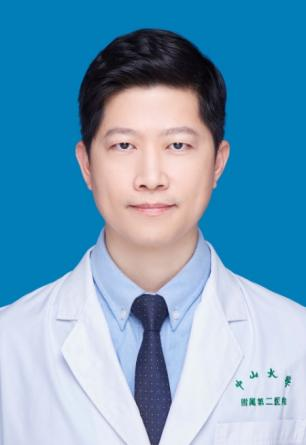

<!-- AUTO-GENERATED-BY: work/generate_obsidian_profiles.py -->

<!-- TEMPLATE: D:\workspace\信息收集整理\医生画像仓库\模板\医生画像模板.md -->

# 伍耀豪

## 基础信息

| 字段 | 内容 |
|---|---|
| 姓名 | 伍耀豪 |
| 医院 | 中山大学孙逸仙纪念医院 |
| 科室 | 小儿外科 |
| 职称/身份 | 副主任医师 |
| 来源链接 | [官网原文](https://www.gzsys.org.cn/node/15368) |
| 采集日期 | 2026-08-13 |

## 简介/擅长

## 科研项目与成果

- 自2007年开始一直从事小儿外科临床、教学和科研工作。
- 主持广东省医学科学研究基金项目1项，参与多项国家级、省级科研项目。

## 论文与学术产出

- 发表临床和基础研究论文20余篇，其中，第一作者和通讯作者SCI论文9篇。

## 可包装亮点

- 担任广东省医学会小儿外科学分会青年委员会委员，广东省抗癌协会小儿肿瘤专业委员会青年委员会常委，广东省健康管理学会小儿外科专业委员会第二届委员会常委委员，广州市医师协会小儿外科分会常务委员，广东省基层医药学会小儿微创外科专业委员会常务委员，广东省医学会儿童危重病医学分会第三届委员会小儿外科学组成员。
- 发表临床和基础研究论文20余篇，其中，第一作者和通讯作者SCI论文9篇。

## 重点疾病/人群标签

- 慢性病：
- 肿瘤：肿瘤、癌、瘤、危重
- 生殖疾病：
- 免疫/风湿：
- 术后恢复/康复：
- 疑难重症：肿瘤、癌、瘤、危重

## 证据摘录

> 只摘录官网公开信息中的短句或关键字段，不复制大段原文。

- 官网身份字段：副主任医师
- 官网亮眼经历线索：担任广东省医学会小儿外科学分会青年委员会委员，广东省抗癌协会小儿肿瘤专业委员会青年委员会常委，广东省健康管理学会小儿外科专业委员会第二届委员会常委委员，广州市医师协会小儿外科分会常务委员，广东省基层医药学会小儿微创外科专业委员会常务委员，广东省医学会儿童危重病医学分会第三届委员会小儿外科学组成员。 发表临床和基础研究论文20余篇，其中，第一作者和通讯作者SCI论文9篇。
- 来源链接：https://www.gzsys.org.cn/node/15368

## BD 画像摘要

伍耀豪医生可作为肿瘤、疑难重症方向的基础画像候选。后续 BD 使用应继续以官网来源和人工复核为准，不添加疗效承诺或无来源包装。

## 合规边界

- 仅使用医院官网、官方公众号、官方小程序等公开渠道。
- 不采集私人电话、私人微信、家庭住址、患者隐私或非公开排班信息。
- 不写“保证治愈”“疗效第一”“包治疑难杂症”等无法由官网证明的表述。
