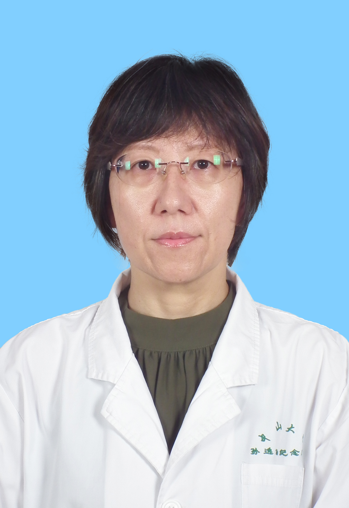

<!-- AUTO-GENERATED-BY: work/generate_obsidian_profiles.py -->

<!-- TEMPLATE: D:\workspace\信息收集整理\医生画像仓库\模板\医生画像模板.md -->

# 伍虹

## 基础信息

| 字段 | 内容 |
|---|---|
| 姓名 | 伍虹 |
| 医院 | 中山大学孙逸仙纪念医院 |
| 科室 | 口腔科 |
| 职称/身份 | 副主任医师 |
| 来源链接 | [官网原文](https://www.gzsys.org.cn/doctor/14667) |
| 采集日期 | 2026-08-13 |

## 简介/擅长

## 教育与进修经历

- 牙体牙髓专科主任 美国匹兹堡大学牙学院博士后、访问学者 广州市口腔预防保健技术指导专家委员会副主任委员、 广东省儿童口腔医学专委会常委 广东省牙体牙髓专委会委员， 从事口腔临床和基础研究工作近二十年，熟练掌握各种口腔常见疾病的诊断和治疗，熟练完成各类义齿的修复、门诊小手术和各类拔牙术；

## 可包装亮点

- 牙体牙髓专科主任 美国匹兹堡大学牙学院博士后、访问学者 广州市口腔预防保健技术指导专家委员会副主任委员、 广东省儿童口腔医学专委会常委 广东省牙体牙髓专委会委员， 从事口腔临床和基础研究工作近二十年，熟练掌握各种口腔常见疾病的诊断和治疗，熟练完成各类义齿的修复、门诊小手术和各类拔牙术；
- 尤其擅长龋病、急/慢性牙髓炎和根尖周炎等各种牙体牙髓疾病的诊治，对复杂、弯曲钙化根管的根管治疗、根管再治疗、根管异物的处理等各种疑难病例经验丰富。

## 重点疾病/人群标签

- 慢性病：慢性、疑难、复杂
- 肿瘤：
- 生殖疾病：
- 免疫/风湿：
- 术后恢复/康复：
- 疑难重症：慢性、疑难、复杂

## 证据摘录

> 只摘录官网公开信息中的短句或关键字段，不复制大段原文。

- 官网身份字段：副主任医师
- 官网亮眼经历线索：牙体牙髓专科主任 美国匹兹堡大学牙学院博士后、访问学者 广州市口腔预防保健技术指导专家委员会副主任委员、 广东省儿童口腔医学专委会常委 广东省牙体牙髓专委会委员， 从事口腔临床和基础研究工作近二十年，熟练掌握各种口腔常见疾病的诊断和治疗，熟练完成各类义齿的修复、门诊小手术和各类拔牙术； 尤其擅长龋病、急/慢性牙髓炎和根尖周炎等各种牙体牙髓疾病的诊治，对复杂、弯曲钙化根管的根管治疗、根管再治疗、根管异物的处理等各种疑难病例经验丰富。
- 来源链接：https://www.gzsys.org.cn/doctor/14667

## BD 画像摘要

伍虹医生可作为慢性病、疑难重症方向的基础画像候选。后续 BD 使用应继续以官网来源和人工复核为准，不添加疗效承诺或无来源包装。

## 合规边界

- 仅使用医院官网、官方公众号、官方小程序等公开渠道。
- 不采集私人电话、私人微信、家庭住址、患者隐私或非公开排班信息。
- 不写“保证治愈”“疗效第一”“包治疑难杂症”等无法由官网证明的表述。
