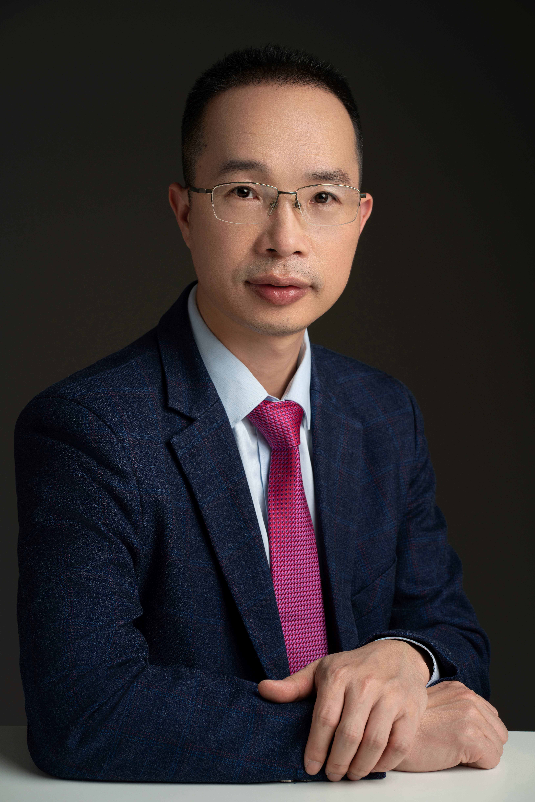

<!-- AUTO-GENERATED-BY: work/generate_obsidian_profiles.py -->

<!-- TEMPLATE: D:\workspace\信息收集整理\医生画像仓库\模板\医生画像模板.md -->

# 何旺

## 基础信息

| 字段 | 内容 |
|---|---|
| 姓名 | 何旺 |
| 医院 | 中山大学孙逸仙纪念医院 |
| 科室 | 泌尿外科 |
| 职称/身份 | 教授, 主任医师 |
| 来源链接 | [官网原文](https://www.gzsys.org.cn/node/15266) |
| 采集日期 | 2026-08-13 |

## 简介/擅长

## 教育与进修经历

- 教授，主任医师，博士生导师，博士后合作导师。

## 科研项目与成果

- 先后主持国家重点研发课题1项、国家自然科学基金面上项目3项、省部级及市级课题各1项。

## 论文与学术产出

- 参编国家级膀胱癌诊疗指南和前列腺癌诊疗指南，以及根治性膀胱切除和保膀胱综合治疗等多项共识。
- 在国外知名杂志及国内核心杂志发表论著20余篇，其中在J Clin Invest、Nat Commun、Cancer Res等国际著名期刊发表多篇膀胱癌相关高质量研究论文。

## 可包装亮点

- 教授，主任医师，博士生导师，博士后合作导师。
- 先后主持国家重点研发课题1项、国家自然科学基金面上项目3项、省部级及市级课题各1项。
- 参编国家级膀胱癌诊疗指南和前列腺癌诊疗指南，以及根治性膀胱切除和保膀胱综合治疗等多项共识。
- 兼任中华医学会泌尿外科学分会微创学组委员、中国医师协会泌尿外科医师分会微创及机器人学组委员、中国老年保健协会泌尿男科分会常委、广东省医学会微创外科学分会副主委、广东省医师协会机器人分会副主委、广东省医学会泌尿外科学分会委员兼秘书等。

## 重点疾病/人群标签

- 慢性病：
- 肿瘤：肿瘤、癌
- 生殖疾病：
- 免疫/风湿：
- 术后恢复/康复：
- 疑难重症：

## 证据摘录

> 只摘录官网公开信息中的短句或关键字段，不复制大段原文。

- 官网身份字段：教授, 主任医师
- 官网亮眼经历线索：教授，主任医师，博士生导师，博士后合作导师。 先后主持国家重点研发课题1项、国家自然科学基金面上项目3项、省部级及市级课题各1项。 参编国家级膀胱癌诊疗指南和前列腺癌诊疗指南，以及根治性膀胱切除和保膀胱综合治疗等多项共识。 兼任中华医学会泌尿外科学分会微创学组委员、中国医师协会泌尿外科医师分会微创及机器人学组委员、中国老年保健协会泌尿男科分会常委、广东省医学会微创外科学分会副主委、广东省医师协会机器人分会副主委、广东省医学会泌尿外科学…
- 来源链接：https://www.gzsys.org.cn/node/15266

## BD 画像摘要

何旺医生可作为肿瘤方向的基础画像候选。后续 BD 使用应继续以官网来源和人工复核为准，不添加疗效承诺或无来源包装。

## 合规边界

- 仅使用医院官网、官方公众号、官方小程序等公开渠道。
- 不采集私人电话、私人微信、家庭住址、患者隐私或非公开排班信息。
- 不写“保证治愈”“疗效第一”“包治疑难杂症”等无法由官网证明的表述。
