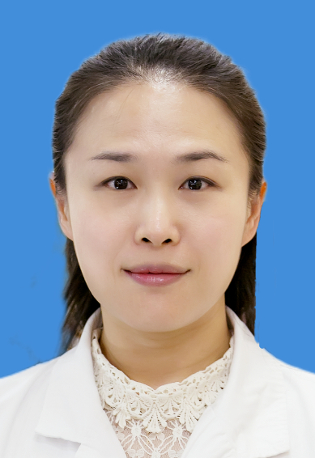

<!-- AUTO-GENERATED-BY: work/generate_obsidian_profiles.py -->

<!-- TEMPLATE: D:\workspace\信息收集整理\医生画像仓库\模板\医生画像模板.md -->

# 余晓霞

## 基础信息

| 字段 | 内容 |
|---|---|
| 姓名 | 余晓霞 |
| 医院 | 中山大学孙逸仙纪念医院 |
| 科室 | 药学部 |
| 职称/身份 | 主任药师 |
| 来源链接 | [官网原文](https://www.gzsys.org.cn/node/14708) |
| 采集日期 | 2026-08-13 |

## 简介/擅长

## 教育与进修经历

- 副主任药师，药学部副主任、广东省药学会药师处方审核培训师资、新华学院药学院兼职教师，广东省药学会个体化药学服务专委会副主任委员、广东省药学会临床药学服务与实践专委会副主任委员、广东省药学会医院制剂专委会常务委员等，获广东省医院药学科学技术二、三等奖3项、广东省药学会药师处方审核培训优秀教师等称号，专业方向：医院制剂与精准药学。

## 可包装亮点

- 副主任药师，药学部副主任、广东省药学会药师处方审核培训师资、新华学院药学院兼职教师，广东省药学会个体化药学服务专委会副主任委员、广东省药学会临床药学服务与实践专委会副主任委员、广东省药学会医院制剂专委会常务委员等，获广东省医院药学科学技术二、三等奖3项、广东省药学会药师处方审核培训优秀教师等称号，专业方向：医院制剂与精准药学。

## 重点疾病/人群标签

- 慢性病：
- 肿瘤：
- 生殖疾病：
- 免疫/风湿：
- 术后恢复/康复：
- 疑难重症：

## 证据摘录

> 只摘录官网公开信息中的短句或关键字段，不复制大段原文。

- 官网身份字段：主任药师
- 官网亮眼经历线索：副主任药师，药学部副主任、广东省药学会药师处方审核培训师资、新华学院药学院兼职教师，广东省药学会个体化药学服务专委会副主任委员、广东省药学会临床药学服务与实践专委会副主任委员、广东省药学会医院制剂专委会常务委员等，获广东省医院药学科学技术二、三等奖3项、广东省药学会药师处方审核培训优秀教师等称号，专业方向：医院制剂与精准药学。
- 异常提示：职称/身份需人工复核
- 来源链接：https://www.gzsys.org.cn/node/14708

## BD 画像摘要

余晓霞医生可作为中山大学孙逸仙纪念医院药学部的基础医生资料入库。当前重点方向以总底表标签为准，官网未展示的信息保持空白。

## 合规边界

- 仅使用医院官网、官方公众号、官方小程序等公开渠道。
- 不采集私人电话、私人微信、家庭住址、患者隐私或非公开排班信息。
- 不写“保证治愈”“疗效第一”“包治疑难杂症”等无法由官网证明的表述。
