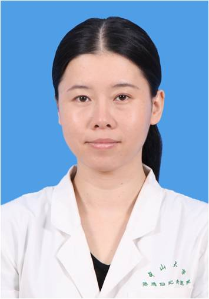

<!-- AUTO-GENERATED-BY: work/generate_obsidian_profiles.py -->

<!-- TEMPLATE: D:\workspace\信息收集整理\医生画像仓库\模板\医生画像模板.md -->

# 刘墨

## 基础信息

| 字段 | 内容 |
|---|---|
| 姓名 | 刘墨 |
| 医院 | 中山大学孙逸仙纪念医院 |
| 科室 | 口腔科 |
| 职称/身份 | 副主任医师 |
| 来源链接 | [官网原文](https://www.gzsys.org.cn/node/14686) |
| 采集日期 | 2026-08-13 |

## 简介/擅长

## 教育与进修经历

- 毕业于中山大学，获得博士学位。

## 科研项目与成果

- 留校于中山大学孙逸仙纪念医院，从事牙周病的医疗，教学和科研工作近二十年，擅长牙周病的诊断治疗，具有丰富的临床经验。
- 主持国家自然科学基金及广东省自然科学基金。

## 论文与学术产出

- 发表学术论文十余篇。

## 可包装亮点

- 主持国家自然科学基金及广东省自然科学基金。
- 发表学术论文十余篇。
- 曾在国家级及省级根管治疗，牙周病治疗病例比赛中获奖。
- 担任广东省口腔医学会牙周分会常务委员，广东省整形美容协会口腔分会常务委员，中华口腔医学会牙周病学专业委员会委员。

## 重点疾病/人群标签

- 慢性病：
- 肿瘤：
- 生殖疾病：
- 免疫/风湿：
- 术后恢复/康复：
- 疑难重症：

## 证据摘录

> 只摘录官网公开信息中的短句或关键字段，不复制大段原文。

- 官网身份字段：副主任医师
- 官网亮眼经历线索：主持国家自然科学基金及广东省自然科学基金。 发表学术论文十余篇。 曾在国家级及省级根管治疗，牙周病治疗病例比赛中获奖。 担任广东省口腔医学会牙周分会常务委员，广东省整形美容协会口腔分会常务委员，中华口腔医学会牙周病学专业委员会委员。
- 来源链接：https://www.gzsys.org.cn/node/14686

## BD 画像摘要

刘墨医生可作为中山大学孙逸仙纪念医院口腔科的基础医生资料入库。当前重点方向以总底表标签为准，官网未展示的信息保持空白。

## 合规边界

- 仅使用医院官网、官方公众号、官方小程序等公开渠道。
- 不采集私人电话、私人微信、家庭住址、患者隐私或非公开排班信息。
- 不写“保证治愈”“疗效第一”“包治疑难杂症”等无法由官网证明的表述。
