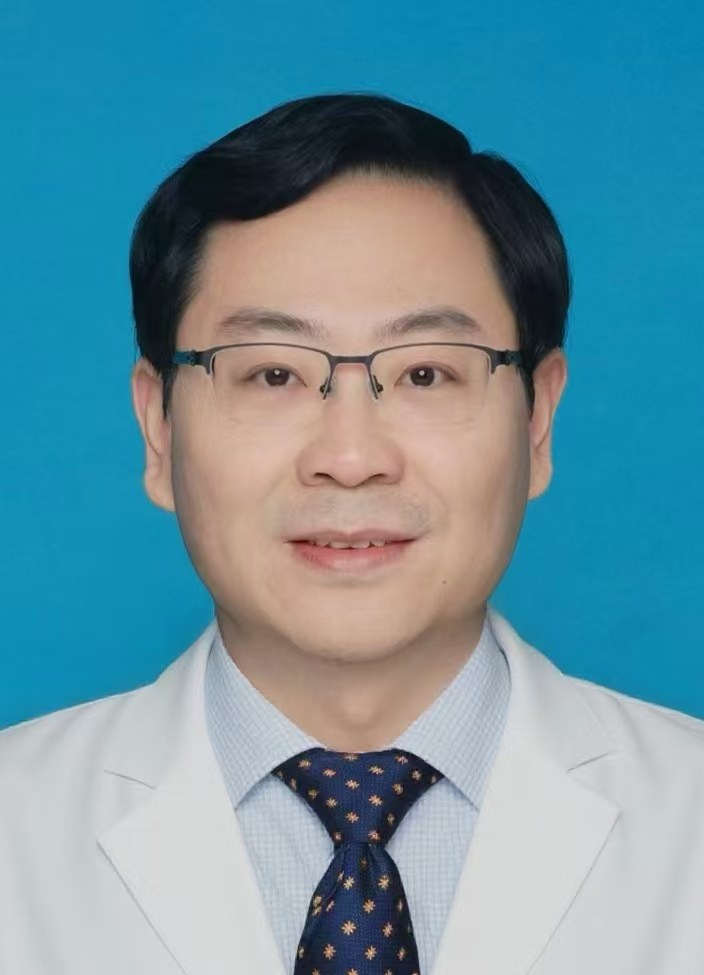

<!-- AUTO-GENERATED-BY: work/generate_obsidian_profiles.py -->

<!-- TEMPLATE: D:\workspace\信息收集整理\医生画像仓库\模板\医生画像模板.md -->

# 刘天润

## 基础信息

| 字段 | 内容 |
|---|---|
| 姓名 | 刘天润 |
| 医院 | 中山大学孙逸仙纪念医院 |
| 科室 | 甲状腺外科 |
| 职称/身份 | 教授, 主任医师 |
| 来源链接 | [官网原文](https://www.gzsys.org.cn/doctor/29537) |
| 采集日期 | 2026-08-13 |

## 简介/擅长

## 教育与进修经历

- 主任医师，教授，博士生导师，博士后合作导师，肿瘤学(外科)博士；

## 科研项目与成果

- 临床科研：重点研究了甲状腺癌的危险分层和个体化治疗、肿瘤微环境在甲状腺癌失分化和转移中的机制研究等。
- 主持国家自然基金、省部级科研课题10余项。

## 论文与学术产出

- 发表论文60余篇，其中以第一/通讯作者在 Nature Communications、Cancer Research 及 Oral Oncology 等期刊发表论文40余篇，其中5篇次被ATA等国际权威指南/共识引用。

## 可包装亮点

- 主任医师，教授，博士生导师，博士后合作导师，肿瘤学(外科)博士；
- 中山大学孙逸仙纪念医院 甲状腺外科主任；
- 临床专长：甲状腺癌的精准诊断和规范治疗、复杂性甲状腺癌的外科治疗、甲状腺低分化/未分化癌的综合治疗、甲状腺腔镜手术和机器人手术等。
- 发表论文60余篇，其中以第一/通讯作者在 Nature Communications、Cancer Research 及 Oral Oncology 等期刊发表论文40余篇，其中5篇次被ATA等国际权威指南/共识引用。

## 重点疾病/人群标签

- 慢性病：
- 肿瘤：肿瘤、癌、康复、复杂
- 生殖疾病：
- 免疫/风湿：
- 术后恢复/康复：肿瘤、癌、康复、复杂
- 疑难重症：肿瘤、癌、康复、复杂

## 证据摘录

> 只摘录官网公开信息中的短句或关键字段，不复制大段原文。

- 官网身份字段：教授, 主任医师
- 官网亮眼经历线索：主任医师，教授，博士生导师，博士后合作导师，肿瘤学(外科)博士； 中山大学孙逸仙纪念医院 甲状腺外科主任； 临床专长：甲状腺癌的精准诊断和规范治疗、复杂性甲状腺癌的外科治疗、甲状腺低分化/未分化癌的综合治疗、甲状腺腔镜手术和机器人手术等。 发表论文60余篇，其中以第一/通讯作者在 Nature Communications、Cancer Research 及 Oral Oncology 等期刊发表论文40余篇，其中5篇次被ATA等国际…
- 来源链接：https://www.gzsys.org.cn/doctor/29537

## BD 画像摘要

刘天润医生可作为肿瘤、术后恢复/康复、疑难重症方向的基础画像候选。后续 BD 使用应继续以官网来源和人工复核为准，不添加疗效承诺或无来源包装。

## 合规边界

- 仅使用医院官网、官方公众号、官方小程序等公开渠道。
- 不采集私人电话、私人微信、家庭住址、患者隐私或非公开排班信息。
- 不写“保证治愈”“疗效第一”“包治疑难杂症”等无法由官网证明的表述。
